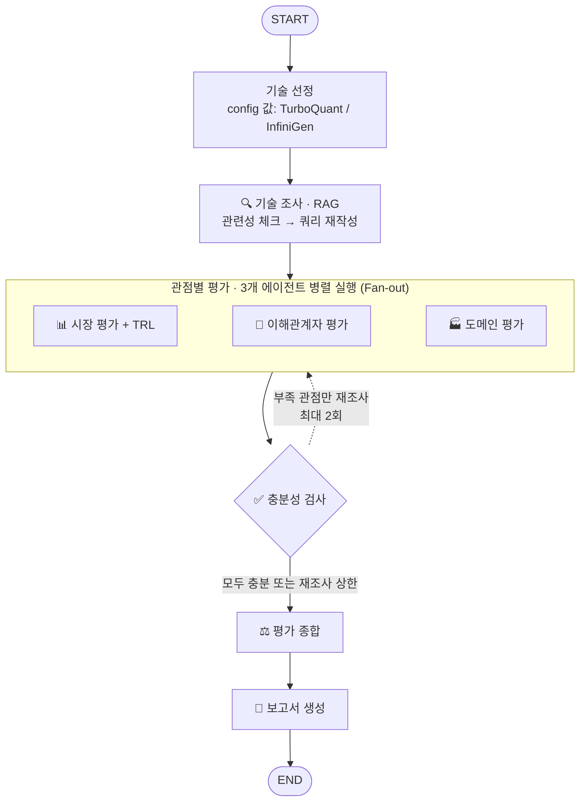

# KV cache 최적화 기술 다관점 평가 Agent

KV cache 병목을 반대 방향에서 푸는 SW 기술(TurboQuant)과 시스템·메모리 계층 활용 기술(InfiniGen)을 TRL·시장·이해관계자·도메인 관점에서 조사하고, 관점에 따라 평가가 어떻게 엇갈리는지 비교하는 평가 보고서를 자동 생성하는 Agentic RAG 시스템입니다.

## Overview

- **Objective**: 하나의 기술이 관점에 따라 어떻게 다르게 평가되는지 중립적으로 비교합니다. 우열 판정이나 추천은 하지 않습니다.
- **Method**: Multi-Agent(Distributed, Fan-out) + Agentic RAG (관련성 체크 → 쿼리 재작성 루프, 근거 충분성 검사 → 재조사 루프)
- **Domain**: 데이터센터/클라우드 서빙 (대규모, 비용 민감)
- **Tools**: 논문 검색(RAG), 웹 검색(Tavily)

## Selected Technologies

| 진영 | 기술 | 원문 | 선정 이유 |
|---|---|---|---|
| SW: 데이터를 작게 | TurboQuant (Google) | arXiv 2504.19874 (2025) | 재학습 없이 KV cache를 저비트로 양자화하는 사후 압축 방식 → 기존 서빙 인프라에 바로 얹을 수 있는 SW 진영의 대표 접근 |
| 시스템: GPU 밖으로 옮겨 쓰기 | InfiniGen (서울대) | OSDI 2024, arXiv 2406.19707 | KV cache를 호스트 메모리로 오프로딩하고 필요한 항목만 프리패치 → 학회 검증과 공개 코드가 있어 TRL·재현성 근거가 풍부 |

같은 GPU 서버에서 "cache를 작게 만드는 방법"과 "cache를 밖으로 내보내되 빠르게 가져오는 방법"이 정면으로 대비되어, 정확도 손실과 전송 지연이라는 트레이드오프가 관점별로 다르게 평가됩니다.

## Features

**핵심 차별점**: RAG 검색 품질의 정량 평가(Hit Rate@5, MRR) · 결정적 `source_id`로 근거를 끝까지 추적 · 근거가 부족한 관점만 다시 조사하는 Agentic Loop · 지지뿐 아니라 한계·반론 근거까지 찾는 확증 편향 방지 구조

- 논문 PDF 기반 기술 정보 추출 (원리·범위·핵심 수치·한계, 수치는 검색된 청크에 있는 값만)
- 시장·이해관계자·도메인 관점 병렬 평가, TRL 9단계 기준 성숙도 추정 (공개 정보 기반 추정임을 명시)
- **확증 편향 방지 전략**
  - 관점마다 지지·한계·반론 쿼리를 각각 검색 (최종 stance는 검색 의도가 아니라 실제 검색 결과 내용 기준으로 판정)
  - 충분성 검사: 관점·기술별 근거 4개 이상, 지지·한계·반론 각 1개 이상, 한 출처 비율 50% 이하 → 미달 관점만 쿼리를 바꿔 재조사 (최대 2회)
  - 끝까지 부족한 근거는 만들어내지 않고 보고서 한계점에 기록
- 보고서 자동 생성: 목차 순서 작성, 본문 인용 번호와 REFERENCE 자동 연결(근거로 쓴 출처만, 문서 단위 중복 제거), 기술×관점 근거 분포 표
- **보고서 환각 방지**: 챕터 입력에 없던 인용 번호·쪽수는 삭제, 한 기술을 다루는 문장에는 그 기술 근거의 인용만 허용, 근거가 없는 관점은 LLM이 추측으로 채우지 않고 "공개 근거 미확인"으로 표기, 수집 오류는 기술의 한계와 분리해 한계점에 기록

## Tech Stack

| Category | Details |
|---|---|
| Framework | LangGraph, LangChain, Python 3.11 |
| LLM / Generator | gpt-4o-mini (OpenAI, temperature 0) — 요약·종합·보고서 문장 |
| LLM / Judge | gpt-4o-mini (OpenAI, temperature 0) — 관련성 체크·근거 분류 |
| Retrieval | FAISS (dense, MMR λ=0.7, Top-5) — **Hit Rate@5 1.00, MRR@5 0.69** (한국어 질문 12개, 기술당 6개 / MRR: TurboQuant 0.78, InfiniGen 0.60) |
| Embedding | BAAI/bge-m3 (오픈소스, 로컬 실행) — 한국어 질의로 영어 논문을 찾는 교차 언어 검색 |
| Web Search | Tavily |
| Report | fpdf2 + 나눔고딕 (OFL) |

## Agents

| Agent | 역할 | RAG | 웹 검색 |
|---|---|---|---|
| 🔍 기술 조사 | 논문에서 기술 개요·범위·핵심 수치·한계 추출 (관련성 체크 → 쿼리 재작성) | O | X |
| 📊 시장 평가 | 시장 규모·성장성, 상용화·채택, 생태계 조사 + TRL 추정 | X | O |
| 🤝 이해관계자 평가 | 경쟁 진영, 도입 기업·개발자, 투자 업계 반응 조사 | X | O |
| 🏭 도메인 평가 | 비용·처리량·모델 품질·전송 오버헤드·도입 난이도 5개 지표 평가 | X | O |
| ✅ 충분성 검사 | 관점별 근거 수·출처 다양성·지지/한계·반론 균형 판정 → 부족 관점 재조사 지시 | X | X |
| ⚖️ 평가 종합 | 관점 간 일치·상충 지점 정리 | X | X |
| 📝 보고서 생성 | 목차 순서로 PDF 작성, 인용·REFERENCE 연결 | X | X |

## Architecture



실제 컴파일된 그래프는 `python app.py --mermaid`로 확인할 수 있습니다. 기술 조사의 관련성 체크 → 쿼리 재작성 루프는 노드 내부에서 동작합니다.

## Directory Structure

```
├── app.py              # 실행 스크립트
├── graph.py            # 그래프 조립 (Fan-out, 조건 분기, 재조사 루프)
├── state.py            # 공유 State 스키마
├── config.py           # 모델·기준값·경로 설정
├── llm.py              # 공용 LLM 호출
├── agents/             # Agent 모듈 (research, market, stakeholder, domain, check, synthesis, report)
├── rag/                # 논문 로딩·인덱싱·검색
├── tools/              # 웹 검색 도구
├── prompts/            # 프롬프트 템플릿
├── eval/               # 검색 평가 (Hit Rate@5, MRR)
├── data/papers/        # 문서 풀 (논문 PDF 2편, 43p)
├── assets/fonts/       # 보고서 한글 폰트
├── tests/              # 노드 단독 테스트
├── docs/               # 설계서, 개발 계약서
└── outputs/            # 평가 보고서 (실행 시 생성)
```

## Usage

```bash
python -m venv .venv && source .venv/bin/activate   # Windows: .venv\Scripts\activate
pip install -r requirements.txt
cp .env.example .env        # Windows: copy .env.example .env / OPENAI_API_KEY, TAVILY_API_KEY 입력
```

**논문 PDF 준비** (`data/papers/`는 git 제외, 최초 1회): RAG가 읽는 arXiv 논문 2편(v1 고정, 25p·18p)을 내려받고 SHA-256으로 무결성을 확인합니다. Windows는 Git Bash에서 실행하세요.

```bash
mkdir -p data/papers
curl -fL --retry 3 https://arxiv.org/pdf/2504.19874v1 -o data/papers/2504.19874_TurboQuant.pdf
curl -fL --retry 3 https://arxiv.org/pdf/2406.19707v1 -o data/papers/2406.19707_InfiniGen.pdf

printf '%s\n' \
  '431eb13926e10491f5fbd0bebd0813c51bd6c1e884426a1500c5db640b2997ab  data/papers/2504.19874_TurboQuant.pdf' \
  '267d689a1ded953f076eb93976c0ebeac1ad02029f1f7c9dd1c947aa05d7cb5f  data/papers/2406.19707_InfiniGen.pdf' \
  | sha256sum -c -              # macOS: shasum -a 256 -c -
```

`OK`가 두 번 출력되면 완료입니다. 검증에 실패하면 해당 PDF를 사용하지 말고 다시 내려받으세요 ([TurboQuant v1](https://arxiv.org/abs/2504.19874v1), [InfiniGen v1](https://arxiv.org/abs/2406.19707v1)). PDF 없이 실행하면 기술 조사 단계에서 `[E-1003] 논문 PDF 로딩 실패`가 기록되고 기술 개요가 빈 채로 보고서가 생성됩니다.

```bash
python app.py               # → outputs/RAG-Output_판교_8반_*.pdf (약 3~4분)
```

- 첫 실행 때 임베딩 모델 BAAI/bge-m3(약 2GB)를 Hugging Face에서 내려받습니다.
- 셸에 `OPENAI_API_KEY`가 이미 설정되어 있으면 `.env`보다 먼저 쓰입니다. 인증 오류(401)가 나면 `unset OPENAI_API_KEY` 후 다시 실행하세요.

| 명령 | 용도 |
|---|---|
| `python app.py --dummy` | API 키 없이 가짜 노드로 그래프 흐름 확인 |
| `python app.py --use-cache` | 저장된 웹 검색 결과 재사용 |
| `python eval/retrieval_eval.py` | 검색 평가 (Hit Rate@5, MRR) |
| `python -m pytest tests/` | 노드 단독 테스트 |

## Contributors

- 한석휘 : PDF Parsing, Retrieval Pipeline
- 김명하 : Research Agent, Retrieval Evaluation
- 안소유 : Web Search Tool, Market & TRL Agent
- 김연주 : Stakeholder & Domain Agent, Bias Control
- 윤중우 : Graph Orchestration, Synthesis Agent
- 김효주 : Report Generation, Documentation
