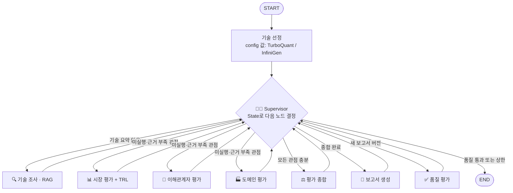

# Subject

본 프로젝트는 KV cache 최적화 기술을 소프트웨어, 하드웨어 두 진영에서 선정하여, TRL·시장·이해관계자·도메인 관점에서 평가하는 **Supervisor 패턴** 기반으로 설계·개발하는 프로젝트입니다. 보고서 생성 후에는 품질 평가 노드가 Groundedness·중립성·편향 통제·관점 커버리지를 판정하고, 미달이면 재작성 루프를 돕니다.

## github link
https://github.com/oojoyhh/skala-KV-cache/tree/agent-supervisor

## Overview

- **Objective**: 하나의 기술을 복수 관점에서 비교 평가 (우열 판정·추천이 아니라, 관점에 따라 평가가 어떻게 갈리는지를 드러냄)
- **Pattern**: **Supervisor** — 필요한 근거의 양이 실행 전에 정해지지 않는 과제이기 때문입니다. "지금까지 모인 근거로 충분한가, 더 조사할 관점은 무엇인가"를 매 턴 판단해야 하므로, 사전 계획을 세워 Worker를 띄우는 Orchestrator-Workers보다 상태 기반 라우팅이 맞습니다.
- **동적 처리**: 고정 순서가 없습니다. Supervisor가 매번 State(관점별 근거 수·stance 균형·출처 다양성·실패 여부)를 읽어 다음 노드를 하나 고릅니다.
  - 실행마다 **호출되는 노드와 호출 횟수가 달라집니다**. 같은 노드가 여러 번 불릴 수 있고, 근거가 충분한 관점은 아예 호출되지 않습니다.
  - 관점 후보가 여럿이면 **근거가 가장 적은 관점부터** 고릅니다. 개수가 같을 때만 고정 순서를 동점 처리에 씁니다(같은 State면 같은 경로를 보장하기 위함).
  - 종료도 스텝 수가 아니라 **충분성 판정과 품질 평가 결과**로 정해집니다. 상한값은 무한 루프 방지용이며, 상한 도달은 통과가 아니라 `run_status = "exhausted"`입니다.
- **Tools**: 논문 검색(RAG, FAISS), 웹 검색(Tavily)

## Selected Technologies

- **SW : TurboQuant (Google, arXiv 2504.19874)** — 재학습 없이 KV cache를 저비트로 양자화하는 사후 압축 방식. 기존 서빙 인프라에 바로 얹을 수 있는 SW 진영의 대표 접근
- **HW : InfiniGen (서울대, OSDI 2024 / arXiv 2406.19707)** — KV cache를 호스트 메모리로 오프로딩하고 필요한 항목만 프리패치. 학회 검증과 공개 코드가 있어 TRL·재현성 근거가 풍부

같은 GPU 서버에서 "cache를 작게 만드는 방법"과 "cache를 밖으로 내보내되 빠르게 가져오는 방법"이 대비되어, 정확도 손실과 전송 지연이라는 트레이드오프가 관점별로 다르게 평가됩니다.

## Features

- 논문 PDF 기반 기술 정보 추출 (원리·범위·핵심 수치·한계, 수치는 검색된 청크에 있는 값만)
- 상태 기반 동적 라우팅 — 부족한 관점만 재조사, 실패 노드만 재시도, 상한 도달 시 마무리 모드
- TRL 9단계 추정 (서로 다른 출처 2건 미만이면 단계를 확정하지 않고 "확정 곤란"으로 표기)
- **확증 편향 방지 전략**
  - 관점마다 지지 쿼리와 한계·반론 쿼리를 각각 검색 (최종 stance는 검색 의도가 아니라 실제 검색 결과 내용으로 판정)
  - 충분성 검사: 관점·기술별 근거 4개 이상, 지지·한계·반론 각 1건 이상, 한 출처 비율 50% 이하
  - 끝까지 확보하지 못한 근거는 만들어내지 않고 보고서 한계점에 기록
- **보고서 품질 평가 (Hybrid)** — 아래 "Quality Gate" 참고
- 보고서 환각 방지: 입력에 없던 인용 번호·쪽수 삭제, 한 기술을 다루는 문장에는 그 기술 근거의 인용만 허용, 근거가 없는 관점은 "공개 근거 미확인"으로 표기, 수집 오류는 기술의 한계와 분리해 기록

## Tech Stack

- **Framework** : LangGraph (Supervisor 패턴, `add_conditional_edges` 기반 상태 라우팅)
- **LLM/Generator** : gpt-4o-mini (temperature 0) — 기술 요약·관점 평가·종합·보고서 문장
- **LLM/Judge** : gpt-4o-mini (temperature 0) — 근거 분류, 보고서 품질 판정(1회 호출로 4항목)
- **Retrieval** : FAISS (dense, MMR λ=0.7, Top-5) — Hit Rate@5 1.00, MRR@5 0.69 (한국어 질문 12개, 기술당 6개)
- **Embedding** : BAAI/bge-m3 (오픈소스, 로컬 실행) — 한국어 질의로 영어 논문을 찾는 교차 언어 검색
- **Web Search** : Tavily
- **Observability** : LangSmith (`trace_id`로 State와 트레이스 상관)
- **Report** : fpdf2 + 나눔고딕 (OFL)

## Agents

| Agent | 역할 | RAG | 웹 검색 |
|---|---|---|---|
| 🧑‍💼 **Supervisor** | State를 읽어 다음 노드를 하나 결정하고 라우팅. 충분성 판정(`evaluate_sufficiency`), 재시도·재조사·종료 관리. `control`의 유일한 작성자 | X | X |
| 🔍 기술 조사 | 논문에서 기술 개요·범위·핵심 수치·한계 추출 (관련성 체크 → 쿼리 재작성 내부 루프) | O | X |
| 📊 시장 평가 | 시장 규모·성장성, 상용화·채택, 생태계 조사 + TRL 추정 | X | O |
| 🤝 이해관계자 평가 | 경쟁 진영, 도입 기업·개발자, 투자 업계 반응 조사 | X | O |
| 🏭 도메인 평가 | 데이터센터/클라우드 서빙에서 비용·처리량·모델 품질·전송 오버헤드·도입 난이도 평가 | X | O |
| ⚖️ 평가 종합 | 관점 간 일치·상충 지점 정리, 미확보 근거를 한계로 기록 | X | X |
| 📝 보고서 생성 | 목차 순서로 작성, 인용·REFERENCE 연결, PDF·Markdown 저장. 재작성 시 품질 피드백 반영 | X | X |
| ✅ 품질 평가 | 생성된 보고서를 규칙 + Judge로 판정 (아래) | X | X |

하위 에이전트는 서로 직접 통신하지 않습니다. 모두 실행 후 Supervisor로 복귀하며, 자기 담당 결과와 `node_result`(실행 성공/실패)만 반환합니다.

### Quality Gate (보고서 품질 평가)

| 항목 | 규칙 검사 (코드) | LLM Judge |
|---|---|---|
| Groundedness | 평가 대상 절(3장·4-1~4-4·5장)의 인용이 모두 REFERENCE와 연결되고, 근거 서술 절에 인용이 있음 | 인용된 문장이 해당 근거(claim)와 의미상 맞는지 |
| 중립성 | 추천·우열 판정 어휘가 없음 | 문맥상 우위 암시가 없는지 |
| 편향 통제 | 한계·반론 근거가 있으면 인용했는지, 출처가 둘 이상인데 하나에만 몰리지 않았는지 | 서술이 한쪽 근거로 기울지 않았는지 |
| 관점 커버리지 | 4관점 × 2기술 각각에 서술이 있거나 "공개 근거 미확인"이 명시됨 | 형식적 한 줄이 아니라 실질적으로 평가했는지 |

- **규칙 검사는 "인용 연결"까지만 보장합니다.** 출처가 주장을 실제로 뒷받침하는지는 Judge가 판단합니다.
- Judge는 **1회 호출**로 네 항목을 함께 판정하며, 입력은 SUMMARY·4-1~4-4·5장과 그 절이 인용한 근거 목록으로 제한합니다(보고서 전문 투입 금지).
- 미달이면 원인에 따라 조치를 **권고**합니다(`action`, `target_node`). 보고서가 근거를 잘못 쓴 것이면 `rewrite`, State 자체에 그 관점 근거가 없거나 한쪽 stance·단일 출처로 쏠린 것이면 `research`와 그 관점 노드를 지정합니다. 다음 노드는 Supervisor가 정하고, 판단 사유는 `route_reason`으로 LangSmith에 남습니다.
- 근거의 최소 기준(충분성) 판정은 Supervisor가 맡습니다. 품질 평가의 `research`는 그 기준은 통과했지만 보고서 품질 관점에서 부족이 드러난 경우의 추가 조사 요청입니다.
- 미달 사유는 `feedback`으로 보고서 노드에 전달되고, 재작성 시 프롬프트에 반영됩니다.

## State Schema

`control`(제어)과 작업 결과(페이로드)를 분리하고, `control`은 Supervisor만 수정합니다.

- **제어 vs 페이로드 분리** : 관점별 결과(`tech_summary`, `trl_result`, `market_result`, `stakeholder_result`, `domain_result`, `synthesis`)는 보고서 입력이고, 흐름 판단에 필요한 값은 `control` 한 곳에 모읍니다. 하위 노드는 `control`을 읽기만 하고, 실행 성공/실패는 `node_result`로만 알립니다. 업무 결과와 실행 상태가 섞이지 않습니다.
- **관측성 위치** : 결정 이력(어떤 노드를 왜 골랐는지)은 State에 쌓지 않습니다. Supervisor가 매번 출력하는 `next_node`·`route_reason`이 LangSmith에 노드 단위로 기록되어 결정 로그가 됩니다. State에는 현재 판단에 필요한 최신 값만 둡니다.
- **지속성 비용** : 논문 원문·검색 본문·보고서 전문은 State에 넣지 않습니다. 보고서는 파일로 저장하고 State에는 경로(`report_path`, `report_md_path`)와 버전만 둡니다. 근거는 `claim + source_id + stance`로 요약해 보관합니다. `references`는 재조사로 늘어날 수 있으나 재조사 상한으로 제한되며, 중복은 보고서 REFERENCE 작성 단계에서 문서 단위로 제거합니다.
- **상관** : `control.trace_id`를 LangSmith 실행 metadata에 같은 값으로 넘겨, State와 트레이스를 서로 찾습니다. 완료 메시지에도 출력합니다.
- **재개/복구** : `node_status`(success/failed/skipped), `node_errors`, `exec_retry_counts`, `evidence_retry_counts`, `report_retry_count`, `dispatch_id`, `run_status`로 어디서 멈췄고 무엇을 다시 해야 하는지 판단합니다. 프로세스 종료 후 영속 재개(SQLite 등 persistent checkpointer)는 이번 범위에서 제외했습니다.
- **동시 처리** : Supervisor가 한 번에 하나의 노드만 호출하므로 같은 키에 동시 쓰기가 없습니다. 여러 노드가 누적해야 하는 `references`만 `Annotated[list, operator.add]` Reducer를 유지합니다. 오래된 결과를 잘못 읽지 않도록 `control.dispatch_id`를 노드가 `node_result.dispatch_id`로 되돌려주고, 값이 다르면 반환 누락으로 처리합니다.
- **종료 보장** : 노드별 실행 실패 재시도(`MAX_EXEC_RETRY`), 관점별 근거 부족 재조사(`MAX_AGENT_RETRY`), 품질 평가 기반 추가 조사(`MAX_QUALITY_RESEARCH`), 보고서 재작성(`MAX_REPORT_RETRY`), 전체 하위 노드 실행 수(`MAX_TOTAL_STEPS`) 상한을 둡니다. 상한에 닿으면 마무리 모드로 들어가 종합·보고서·품질 평가를 각 1회만 시도하고 종료하므로, 추가 실행이 최대 3회로 제한됩니다.

## Architecture

`[TBD: python app.py --mermaid 출력 또는 LangSmith 그래프 이미지로 교체]`


```mermaid
flowchart TD
    START([START]) --> select[기술 선정<br>config 값: TurboQuant / InfiniGen]
    select --> sup{🧑‍💼 Supervisor<br>State로 다음 노드 결정}
    sup -->|기술 요약 없음| research[🔍 기술 조사 · RAG]
    sup -->|미실행·근거 부족 관점| market[📊 시장 평가 + TRL]
    sup -->|미실행·근거 부족 관점| stakeholder[🤝 이해관계자 평가]
    sup -->|미실행·근거 부족 관점| domain[🏭 도메인 평가]
    sup -->|모든 관점 충분| synthesis[⚖️ 평가 종합]
    sup -->|종합 완료| report[📝 보고서 생성]
    sup -->|새 보고서 버전| quality[✅ 품질 평가]
    sup -->|품질 통과 또는 상한| END([END])
    research --> sup
    market --> sup
    stakeholder --> sup
    domain --> sup
    synthesis --> sup
    report --> sup
    quality --> sup
```

## Directory Structure

```
├── app.py                  # 실행 스크립트 (--dummy, --mermaid)
├── graph.py                # hub-and-spoke 그래프 조립
├── state.py                # State·ControlState·NodeResult·QualityResult
├── config.py               # 모델·기준값·상한·경로
├── llm.py                  # 공용 LLM 호출 (generator / judge)
├── orchestration/
│   └── supervisor.py       # 조정 계층: 라우팅 규칙, 충분성 판정 호출
├── agents/                 # 하위 에이전트 (research, market, stakeholder, domain, synthesis, report, quality)
├── output/                 # 보고서 출력 계층 (citations: 인용·출처, renderer: Markdown·PDF)
├── rag/                    # 논문 로딩·인덱싱·검색
├── tools/                  # 웹 검색 도구
├── prompts/                # 프롬프트 템플릿
├── eval/                   # 검색 평가 (Hit Rate@5, MRR)
├── data/papers/            # 문서 풀 (논문 PDF 2편, 43p)
├── assets/fonts/           # 보고서 한글 폰트
├── tests/                  # 노드·라우팅 테스트
├── docs/                   # 설계서, 개발 계약서
└── outputs/                # 보고서 PDF·Markdown (실행 시 생성)
```

## Usage

```bash
python -m venv .venv && source .venv/bin/activate   # Windows: .venv\Scripts\activate
pip install -r requirements.txt
cp .env.example .env        # OPENAI_API_KEY, TAVILY_API_KEY, LANGSMITH_* 입력
```

**논문 PDF 준비** (`data/papers/`는 git 제외, 최초 1회): arXiv 논문 2편(v1 고정, 25p·18p)을 내려받고 SHA-256으로 확인합니다. Windows는 Git Bash에서 실행하세요.

```bash
mkdir -p data/papers
curl -fL --retry 3 https://arxiv.org/pdf/2504.19874v1 -o data/papers/2504.19874_TurboQuant.pdf
curl -fL --retry 3 https://arxiv.org/pdf/2406.19707v1 -o data/papers/2406.19707_InfiniGen.pdf

printf '%s\n' \
  '431eb13926e10491f5fbd0bebd0813c51bd6c1e884426a1500c5db640b2997ab  data/papers/2504.19874_TurboQuant.pdf' \
  '267d689a1ded953f076eb93976c0ebeac1ad02029f1f7c9dd1c947aa05d7cb5f  data/papers/2406.19707_InfiniGen.pdf' \
  | sha256sum -c -              # macOS: shasum -a 256 -c -
```

```bash
python app.py               # → outputs/Agent_판교_8반_*.pdf (약 N분)   [TBD: 실행 시간]
```

- 첫 실행 때 임베딩 모델 BAAI/bge-m3(약 2GB)를 Hugging Face에서 내려받습니다.
- 셸에 `OPENAI_API_KEY`가 이미 설정되어 있으면 `.env`보다 먼저 쓰입니다. 인증 오류(401)가 나면 `unset OPENAI_API_KEY` 후 다시 실행하세요.
- 완료 메시지에 `trace_id`, `run_status`(completed / exhausted), 품질 평가 결과, 재작업 횟수가 출력됩니다. **PDF가 생성됐다고 품질 통과를 뜻하지 않습니다.**

| 명령 | 용도 |
|---|---|
| `python app.py --dummy` | API 키 없이 가짜 노드로 라우팅·루프 확인 |
| `python app.py --mermaid` | 실제 그래프 구조 출력 |
| `python eval/retrieval_eval.py` | 검색 평가 (Hit Rate@5, MRR) |
| `python -m pytest tests/` | 노드·라우팅 테스트 |

## Dynamic Behavior (실행 기록)

`[TBD: 통합 실행 후 기입]`

| 항목 | 값 |
|---|---|
| 라우팅 횟수(하위 노드 실행) | `[TBD]` |
| 근거 부족 재조사 | `[TBD]` (관점별) |
| 보고서 재작성 | `[TBD]` |
| 최종 `run_status` | `[TBD]` |
| LangSmith 트레이스 | `tracing-1.png` 외 `[TBD]`장 |

## Contributors

- 한석휘 : Test Fixtures, Routing Tests, Reproducibility
- 김명하 : Research Agent, Retrieval Evaluation, Design Doc
- 안소유 : Web Search Tool, Market & TRL Agent
- 김연주 : Stakeholder & Domain Agent, Sufficiency Check
- 윤중우 : Supervisor, Graph Orchestration, State Schema, Synthesis Agent
- 김효주 : Quality Gate, Report Generation, Documentation
