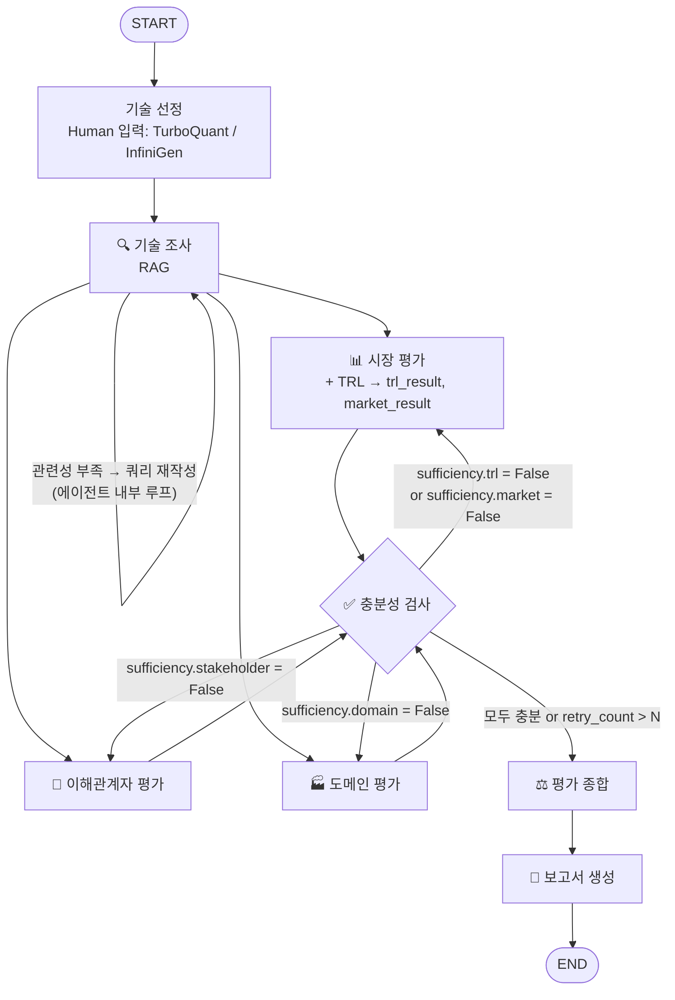

# KV cache 최적화 기술 평가 — 설계 산출물

> 파일명: `RAG-Design_판교-8반_김명하+김연주+김효주+안소유+윤중우+한석휘.pdf`
> 제출: DAY 3 10:00, 반별 Slack 채널 thread (개발 산출물은 DAY 3 15:00)
> 작성 원칙: 우열 판정·추천이 아니라 **"하나의 기술이 관점에 따라 어떻게 다르게 인식되는가"** 를 조사·비교·대조한다. 중립 유지.
> 섹션 A~E는 노션 GUIDE 및 Deliverables 항목 순서와 동일하게 구성.

| 항목 | 내용 |
|---|---|
| 캠퍼스 / 반 | 판교 / 8반 |
| 팀원 | 김명하, 김연주, 김효주, 안소유, 윤중우, 한석휘 |
| 작성일 | 2026-09-21 |
| 버전 | v5 — C-2 TRL 6·7·8 근거 예시 보수화(TRL 예시 확정), 충분성 조건을 지지·한계·반론 근거 기준으로 표현 정리(수치·구조 변경 없음), stance 정의 명시, 그래프 그림 처리 방침 반영. (v4: 평가 종합 입력에 sufficiency, 루프 상한 표기 통일 / v3: source_id, trl_result 분리, 충분성 4관점, 도메인 5지표) |

---

## 0. 문제 정의  `[배점 5 — 선정 도메인에 따라 명확하고 구체적일 것]`

### 0-1. 배경
- KV cache란: LLM이 토큰 생성 시 이전 토큰의 Key/Value를 저장·재사용하는 구조
- 왜 문제인가: 문맥 길이에 비례해 선형 증가 → HBM 소진 → "연산 병목"이 "메모리 병목"으로 전환
- 선정 도메인에서의 문제: 데이터센터/클라우드 서빙은 다중 사용자 요청을 한 GPU에 배치로 태우는데, 요청마다 쌓이는 KV cache가 HBM을 나눠 갖기 때문에 동시 처리 가능한 배치 크기와 처리량이 KV cache 용량에 직접 묶임 → GPU 시간당 비용에 바로 반영

### 0-2. 두 진영
| 구분 | SW: 데이터를 작게 만들자 | HW: 담을 공간을 넓히자 |
|---|---|---|
| 방식 | 사후 압축·양자화 / 어텐션 아키텍처 개선 | HBM 밖 호스트 DRAM·CXL·NVMe로 계층 확장 (오프로딩 + 프리패치) |
| 장점 | 기존 GPU/HBM 위에서 SW만으로 즉시 적용 | 정확도 손실 없이 대용량 확장 |
| 한계 | 압축률↑ → 정확도↓, 아키텍처 변형은 서빙 복잡도 | 신규 인프라 필요, 전송 지연 잔존 |
| 예시 | TurboQuant, KVTC, MLA | InfiniGen(호스트 DRAM 오프로딩), NVIDIA CMX(NVMe), CXL 메모리 |

### 0-3. 선정 도메인과 문제 정의
- 선정 도메인: **데이터센터/클라우드 서빙** — 대규모, 비용 민감
- 도메인 선정 사유: 두 기술 모두 1차 적용 대상이 대규모 서빙 환경이며 비용·처리량 지표로 비교 가능
- 이 프로젝트가 답하려는 질문: "**데이터센터/클라우드 서빙**에서 SW 압축 기술(TurboQuant)과 HW 계층 확장 기술(InfiniGen)은 TRL·시장·이해관계자·도메인 관점에서 각각 어떻게 다르게 평가되는가?"

---

## 1. 대상 기술  `[Deliverables: 대상 기술 — 선정 사유 포함]`

| 진영 | 기술 | 논문 | 발표 시점 | PDF 페이지 수 |
|---|---|---|---|---|
| SW | TurboQuant (Google) | TurboQuant: Online Vector Quantization with Near-optimal Distortion Rate — arXiv 2504.19874 | 2025-04 | 25p (arXiv 표기) |
| HW | InfiniGen (서울대) | InfiniGen: Efficient Generative Inference of Large Language Models with Dynamic KV Cache Management — arXiv 2406.19707, OSDI 2024 | 2024-06 | 18p (arXiv PDF 확인, OSDI 판 pp.155–172) |

- SW 선정 사유: 사후 양자화 방식으로 재학습·재구조화 불필요 → 기존 인프라에 바로 얹을 수 있는 SW 진영의 대표 접근 / 어텐션 처리 속도 최대 8배 보고
- HW 선정 사유: KV cache를 호스트 메모리로 오프로딩하되 필요한 항목만 프리패치하는 "동적 KV 관리" — HW 진영 중 학회(OSDI) 검증을 거쳐 공개 코드가 있어 TRL·재현성 근거가 풍부 / 신규 인프라(CXL 등) 없이 기존 서버 구성에서 동작
- 조합 사유: 같은 GPU 서버 위에서 "cache를 작게 만드는 방법" vs "cache를 밖으로 내보내되 빠르게 가져오는 방법"이 정면으로 대비됨 → 정확도 손실 vs 전송 지연이라는 트레이드오프가 관점별로 다르게 평가되기 좋음
- 검토했으나 제외한 후보와 이유: DeepSeek-V2 MLA — 재학습 필요 구조라 비교 축이 어긋남, 논문 분량 큼 / KIVI — 2비트 양자화 베이스라인으로 TurboQuant와 접근이 겹침 / ITME — 2026-06 공개로 최신이라 시장·이해관계자 웹 자료 부족 / CXL-PIM — 장문맥 도메인 전제라 선정 도메인과 불일치

---

## A. Agent 정의  `[배점 15 — 역할 분리 합리성, 불필요한 에이전트 없이 명확한 책임]`

> 에이전트 1개 = 함수 1개 = 자기 State 키만 채움. 이름은 노션 정의(안)과 동일하게 사용하고, 아래 표의 이름을 State 표·Graph·목차·역할 분담에서 그대로 쓴다.

| # | 에이전트 | 책임 (한 줄) | 입력 (State 키) | 출력 (State 키) | RAG | 웹 검색 도구 |
|---|---|---|---|---|---|---|
| 1 | 🔍 기술 조사 에이전트 | 논문 원문에서 기술 개요·범위·한계·핵심 수치 추출 | tech_sw, tech_hw | tech_summary | O | X |
| 2 | 📊 시장 평가 에이전트 | 시장 규모·성장성, 상용화·채택 현황, 생태계 지지 조사 + TRL 추정 | tech_summary | trl_result, market_result | X | O |
| 3 | 🤝 이해관계자 평가 에이전트 | 경쟁 기술 진영·도입 기업/개발자·투자 업계 반응 조사 | tech_summary | stakeholder_result | X | O |
| 4 | 🏭 도메인 평가 에이전트 | 선정 도메인에서의 적합성 평가 | tech_summary, domain | domain_result | X | O |
| 5 | ✅ 충분성 검사 에이전트 | 관점별 결과의 근거 수·출처 다양성·지지/한계·반론 근거 확보 여부 검증 → 부족 관점 재조사 지시 | trl_result, market_result, stakeholder_result, domain_result | sufficiency, retry_count | X | X |
| 6 | ⚖️ 평가 종합 에이전트 | 관점 간 일치·불일치 지점 정리, 중립 유지 | tech_summary + 4개 result + sufficiency | synthesis | X | X |
| 7 | 📝 보고서 생성 에이전트 | 목차 순서로 PDF 작성, REFERENCE 정리 | 전체 | report_path | X | X |

- 노션 정의(안) 대비 추가/변경과 이유:
  - ✅ 충분성 검사 에이전트 추가 — Loop 구현 및 확증편향 방지
  - 📊 시장 평가 · 🏭 도메인 평가 에이전트의 RAG 여부를 O→X로 변경 — 시장 규모·채택 사례·도메인 도입 사례는 논문 원문에 없어 웹 검색이 적합. 논문 수치는 기술 조사 에이전트가 추출한 tech_summary를 통해 전달받음
  - RAG는 🔍 기술 조사 에이전트 1개에 집중 — 문서 풀을 논문 2편(43p)으로 고정해 검색 품질 평가(Hit Rate@K, MRR)와 임베딩 실험에 집중
- 확증편향 방지 조치: 각 평가 에이전트가 지지(supporting) 쿼리·한계·반론(limitation/challenging) 쿼리를 각각 2개 이상 수행, 동일 출처 비율 상한(한 출처가 관점 근거의 50%를 초과하면 충분성 검사에서 불충분 처리), 충분성 검사에서 한계·반론 근거가 1건 이상 확보됐는지 확인. 개수를 맞추려고 반대 근거를 만들어내지 않으며, 재조사 후에도 없으면 reasons와 보고서 한계점에 '반론 근거 미확인'으로 기록
- RAG 근거 부족은 🔍 기술 조사 에이전트 내부의 관련성 체크→쿼리 재작성 루프(CorrectiveRAG)로 처리 — 충분성 검사는 Fan-out 이후 4개 관점만 담당

### A-1. 도구 정의  `[실습 목표: 외부 정보 검색 및 요약 도구]`
| 도구 | 사용 에이전트 | 입력 | 출력 | 설계 포인트 |
|---|---|---|---|---|
| 🌐 웹 검색 도구 | 시장 평가 · 이해관계자 평가 · 도메인 평가 | 쿼리, 검색 의도(지지 / 한계·반론) | 요약문 + Reference(source_id, 기관/작성자, 날짜, 제목, 사이트명, URL, stance) | Tavily 기반, 신뢰도 필터(도메인 화이트리스트·날짜), Reference 구조로 바로 반환, 검색 결과를 쿼리별로 저장해 재실행 시 재사용하는 캐시 옵션(기본은 실제 검색 — 재현성·API 한도 대응) |
| 📚 문서 검색 도구 (RAG) | 기술 조사 에이전트만 | 쿼리 | 청크 + Reference(source_id, 논문명, 페이지) | B-2 참조 |

---

## B. 설계  `[Deliverables: 기술 선정 방식 · RAG 적용 대상 · Embedding 모델]`

### B-1. 기술 선정 방식
- [ ] 1안: 에이전트 기반 — 선정 자체를 에이전트가 수행
- [x] 2안: Human 기반 — 조가 직접 선정 (TurboQuant / InfiniGen 확정)
- 사유: RAG 문서를 고정해야 200페이지 계산과 임베딩 실험을 사전에 수행 가능, 재현성 확보, 1.5일 일정 내 시간 절약

### B-2. RAG 적용 대상  `[배점 15 — RAG 적용 에이전트 선정 적절성, 문서 선정 전략·활용 방식 타당성]`
- RAG 적용 에이전트: **🔍 기술 조사 에이전트** (1개)
- 웹 검색 사용 에이전트: 📊 시장 평가(+TRL) · 🤝 이해관계자 평가 · 🏭 도메인 평가
- 외부 정보 미사용: ✅ 충분성 검사 · ⚖️ 평가 종합 · 📝 보고서 생성 (State만 입력)
- 적용 사유: 기술 개요·범위·한계·핵심 수치는 논문 원문에서만 정확히 확보 가능하므로 기술 조사를 RAG로 구현. 시장·이해관계자·도메인 정보는 논문 발표 이후의 채택·반응·사례가 핵심이라 논문에 없고 웹 검색이 적합. 세 평가 에이전트는 논문 수치가 필요할 때 tech_summary를 참조

**문서 구성 (총 200페이지 이내)**
| 문서 | 사용 에이전트 | 페이지 | 누적 |
|---|---|---|---|
| TurboQuant 논문 (arXiv 2504.19874) | 기술 조사 | 25 | 25 |
| InfiniGen 논문 (arXiv 2406.19707) | 기술 조사 | 18 | 43 |
| **합계** | | | **43 / 200** |

**파이프라인**
| 단계 | 설계 | 사유 |
|---|---|---|
| 로딩 | PyMuPDF(fitz), 페이지 번호·섹션 헤딩 메타데이터 보존 | 출처 페이지 추적, 2단 논문 텍스트 추출 안정성 |
| 청킹 | {chunk_size 800토큰, overlap 100토큰, 섹션(헤딩) 단위로 먼저 나눈 뒤 길이 분할} | {수식·표가 많은 논문 특성 — 표·수식이 청크 경계에서 잘리지 않도록 섹션 우선} |
| 벡터 DB | FAISS (로컬, 캐시) | 재현성, 설치 부담 없음 |
| 검색기 | {Top-k = 5, MMR 사용(λ=0.7)} — dense 검색 고정 (Hybrid는 이번 범위 제외) | {두 논문에서 같은 주제 청크가 중복 검색되는 것을 MMR로 억제 / 1.5일 일정 내 구현 범위 통제} |
| 검색 평가 | {질문-정답 쌍 12개(기술당 6개, 한국어 질문 → 정답 페이지), Hit Rate@5, MRR} | {README Retrieval 지표 대응} |
| Agentic 요소 | 관련성 체크 → 부족 시 쿼리 재작성 후 재검색 (CorrectiveRAG 패턴) | 단순 검색이 아닌 Agentic RAG 요건 충족, RAG 근거 부족을 그래프 루프 밖에서 해소 |

### B-3. Embedding 모델  `[배점 10 — 오픈소스 필수, "리더보드 상위"는 부적절]`

**선정 모델: `BAAI/bge-m3`**
| 항목 | 내용 |
|---|---|
| 라이선스 | MIT (오픈소스, 상용 제한 없음) |
| 차원 / 최대 길이 | 1024 / 8192 토큰 |
| 다국어 | 100+ 언어 — 한국어 질의로 영어 논문 검색 가능 |
| 검색 모드 | dense 검색 사용 (sparse·multi-vector 지원 모델이나 이번 구현 범위에서는 제외) |
| 로컬 실행 | 약 568M 파라미터, CPU(GPU가 있으면 CUDA·MPS)에서 논문 2편(43p) 인덱싱 수 분 내 가능 |

**선택 기준과 사유**
1. 한국어 질의 + 영어 논문 혼합 — 이 과제는 한국어로 질문하고 영어 논문을 검색해야 하므로 교차 언어 검색이 기본 지원되는 다국어 모델이 필요
2. 기술 용어 처리 — KV cache, quantization, offloading, prefetch 같은 전문 용어가 포함된 질의에서 다국어 dense 검색이 안정적. 여유가 생기면 같은 모델의 sparse 모드로 하이브리드 확장 가능(추가 모델 불필요)
3. 경제성 — API 비용 없이 로컬 실행, 43페이지 규모에서 인덱싱·재실행 부담 없음 → 재현성 항목에 유리
4. 구현 위험 — 수업 노트북(`langchain-v1/14-Retriever/04b-BGE-M3`)에 적용 코드가 있어 1.5일 일정에서 검증된 경로로 구현 가능

**적용 전략**
- 논문 2편을 dense 임베딩으로 인덱싱해 FAISS에 보관, 인덱스는 캐시해 재실행 시 재사용
- 검색 품질은 한국어 질문-정답 페이지 평가셋({12}개)으로 Hit Rate@5, MRR 측정 → README Retrieval 지표에 기재

---

## C. 평가 관점 및 기준  `[배점 15 — 4가지 관점별 평가 대상과 기준]`

> 선정 도메인은 0-3 참조. 4가지 관점 = ① 기술 성숙도(TRL) ② 시장성 ③ 이해관계자 ④ 도메인 적용. ⑤ 종합 의견은 관점이 아니라 1~4를 묶는 단계.

### C-1. 관점별 평가 대상 및 기준
| 관점 | 평가 대상 (무엇을 보는가) | 평가 기준 (어떻게 판단하는가) | 정보원 | 담당 에이전트 | 산출 형식 (State) |
|---|---|---|---|---|---|
| ① 기술 성숙도 (TRL) | 논문 공개 여부, 공개 코드, 프로토타입, 제품 탑재·채택 사례 | C-2 TRL 9단계표 기준. **공개 정보 기반 추정임을 반드시 명시**, 4~6 구간 정보 공백 언급 | 논문, GitHub, 기업 발표 | 시장 평가 | `TRLEstimate` (level, rationale, evidence, uncertainty) → `trl_result` |
| ② 시장성 | 시장 규모·성장성 / 상용화·채택 현황 / 생태계 지지 — 시장 단위: TurboQuant는 "LLM 추론 최적화·KV cache 압축 SW", InfiniGen은 "추론용 메모리 확장·KV 오프로딩 인프라" 시장으로 각각 정의 | 시장 리포트 수치, 실제 도입·제품 출시 사례 수, 지원 프레임워크·표준화 동향 | 시장 리포트, 산업 뉴스, 제품 발표 | 시장 평가 | `MarketResult` (market_size_growth / adoption / ecosystem) |
| ③ 이해관계자 | 경쟁 기술 진영 / 도입 기업·개발자 / 투자 업계 | 집단별 반응·대응 기술, 도입 의견·채택 장벽, 투자 동향·애널리스트/미디어 평가 — 지지·한계·반론 근거 모두 탐색 | 뉴스, 블로그, 커뮤니티, IR | 이해관계자 평가 | `StakeholderResult` (competitors / adopters_devs / investors) |
| ④ 도메인 적용 | 데이터센터/클라우드 서빙에서의 ① 비용 ② 처리량 ③ 모델 품질(압축·오프로딩 후 정확도 유지) ④ 전송 오버헤드(GPU↔호스트 이동 부담) ⑤ 도입 난이도 | 도입 사례·벤치마크 보고 + tech_summary의 논문 수치를 도메인 특성(대규모·비용 민감)에 대입. TurboQuant는 ③, InfiniGen은 ④가 핵심 검증 지점 | 웹 검색(도입 사례, 클라우드 벤치마크), tech_summary | 도메인 평가 | `DomainResult` (cost / throughput / model_quality / transfer_overhead / deployment_barrier) |
| ⑤ 종합 의견 | ①~④ 결과 | 관점 간 일치·상충 지점을 명시적으로 드러냄, 우열·추천 배제 | 위 4개 결과 | 평가 종합 | `Synthesis` (agreements / conflicts) |

### C-2. TRL 9단계 판정 기준표
| TRL | 정의 | 공개 정보 특성 | 판단 근거 예 |
|---|---|---|---|
| 1 | 기초 원리 관찰, 아이디어/이론 수준 | 대부분 공개 (논문·학회·특허) | 개념 논문·특허 출원만 존재, 실험 결과 없음 |
| 2 | 기술 개념 정립, 적용 가능성 검토 | 대부분 공개 | 적용 시나리오 제시, 시뮬레이션·이론 분석 수준 |
| 3 | 개념 검증, 실험실 수준 실증 | 대부분 공개 | 논문 + 실험 결과 (TurboQuant·InfiniGen 공통 출발점) |
| 4 | 부품 검증, 실험실 환경 통합 | **GAP 최대** (영업 비밀) | 공개 코드, 재현 실험 |
| 5 | 부품 검증(실환경), 유사 환경 통합 테스트 | GAP 최대 | 프로토타입, 벤치마크 |
| 6 | 시스템 시연, 실제 환경 유사 조건 시연 | GAP 최대 | 실제 LLM 서빙과 유사한 환경에서 시스템·프로토타입이 통합 시연된 근거 (예: 서빙 프레임워크에 통합된 구현의 end-to-end 벤치마크 공개). 통합 PR 제출만으로는 해당하지 않음 |
| 7 | 시스템 시제품, 실제 운용 환경 시연 | 일부 공개 (샘플 공급 등) | 실제 운영 환경의 pilot·preview·beta 적용 근거 (기업 파일럿 도입 발표, 클라우드 프리뷰·베타 서비스) |
| 8 | 시스템 완성, 양산 적합성 검증 완료 | 일부 공개 | 정식 제품·서비스 출시 + 운영·고객 적용 검증 근거 (출시 발표만으로는 해당하지 않음) |
| 9 | 실제 운용, 상용 양산 및 납품 | 일부 공개 (양산 발표, 실적 공시) | 제품 탑재, 클라우드 채택 |

- 판정 규칙: 해당 단계의 판단 근거 예가 **서로 다른 출처 2개 이상**으로 확인된 가장 높은 단계를 TRL로 판정. 그 위 단계는 근거가 1개뿐이면 "가능성"으로만 rationale에 기록
- 명시 문구(보고서에 포함): "본 TRL은 공개 정보 기반 추정이며, KV cache 기술은 논문 발표 시점과 실제 채택 간 시차가 있어 실제 단계와 다를 수 있음"

---

## D. 그래프 설계  `[State Schema 15 · Graph 15]`

### D-1. State 설계 (table)  `[State 구조가 Graph 흐름에 맞고, 에이전트 간 데이터 흐름이 명확할 것]`

**설계 원칙**
- 관점별 결과는 분리된 키(trl_result / market_result / stakeholder_result / domain_result)로 관리해 병렬(Fan-out) 갱신 충돌 방지
- 각 결과 키 안은 기술별 dict(`"TurboQuant"` / `"InfiniGen"`)로 나눠, 평가 종합 에이전트가 같은 관점에서 두 기술을 나란히 비교
- 모든 근거는 `Evidence`(주장 + source_id + stance)로 통일 → 충분성 검사가 한계·반론 근거 확보 여부를 확인할 수 있음 (확증편향 방지). stance 정의: positive = 지지(supporting), negative = 한계·반론(limitation/challenging), neutral = 중립·배경. negative는 '나쁜 평가'가 아니라 기술의 한계·반론을 담은 근거이며, 검색으로 확보된 것만 사용
- 출처는 `Reference` 구조로 `references`에 reducer(`operator.add`)로 누적. `used_by` 필드로 "실제 사용한 자료만" REFERENCE에 기재
- 출처 식별은 리스트 인덱스가 아니라 **`source_id`(결정적 ID)** 로 함 — 병렬 노드가 각자 반환한 references가 완료 순서대로 합쳐지므로 인덱스는 실행마다 달라져 인용이 어긋남. 생성 규칙: 웹 자료는 `web:` + 정규화 URL의 sha1 앞 10자리, 논문 청크는 `arxiv:<id>#p<page>`. 같은 출처는 같은 ID가 되어 보고서 생성 시 중복 제거하고 `used_by`를 병합
- REFERENCE 중복 제거 키는 **문서 단위**(`#p<page>` 제거) — 같은 논문의 여러 페이지 청크가 REFERENCE에 여러 줄로 실리지 않도록 함. 페이지는 Evidence의 source_id에 남겨 본문 인용(예: [2, p.7])에만 사용
- TRL은 시장 평가 에이전트가 함께 산출하지만 State 키는 `trl_result`로 분리 — 4개 평가 관점과 State 키가 1:1 대응
- 충분성 검사는 4개 관점(trl / market / stakeholder / domain)을 각각 판정. RAG 근거 부족은 기술 조사 에이전트 내부 루프가 담당하므로 Fan-out 앞으로 되돌아가지 않음

**최상위 State**
| 키 | 타입 | 채우는 에이전트 | 읽는 에이전트 | Reducer | 설명 |
|---|---|---|---|---|---|
| tech_sw | TechName | (입력) | 기술 조사 | — | "TurboQuant" |
| tech_hw | TechName | (입력) | 기술 조사 | — | "InfiniGen" |
| domain | str | (입력) | 도메인 평가 | — | "데이터센터/클라우드 서빙" |
| tech_summary | dict[TechName, TechSummary] | 기술 조사 | 시장·이해관계자·도메인 평가, 평가 종합 | — | 기술별 접근·범위·수치·한계 |
| trl_result | dict[TechName, TRLEstimate] | 시장 평가 | 충분성 검사, 평가 종합 | — | 기술 성숙도 (공개 정보 기반 추정) |
| market_result | dict[TechName, MarketResult] | 시장 평가 | 충분성 검사, 평가 종합 | — | 시장성 |
| stakeholder_result | dict[TechName, StakeholderResult] | 이해관계자 평가 | 충분성 검사, 평가 종합 | — | 집단별 반응 |
| domain_result | dict[TechName, DomainResult] | 도메인 평가 | 충분성 검사, 평가 종합 | — | 도메인 적합성 |
| sufficiency | SufficiencyCheck | 충분성 검사 | 조건 분기, 평가 종합 | — | 관점별 충분 여부 + 부족 사유(재조사 쿼리 힌트) |
| retry_count | int | 충분성 검사 | 조건 분기 | — | 불충분 판정 횟수(= 재조사 횟수), 루프 상한 제어 |
| synthesis | Synthesis | 평가 종합 | 보고서 생성 | — | 일치·상충·중립성·한계 |
| references | list[Reference] | 전 에이전트 | 보고서 생성 | `operator.add` | 출처 누적 |
| report_path | str | 보고서 생성 | — | — | PDF 경로 |

**하위 구조**
| 구조 | 필드 | 생산 에이전트 | 용도 |
|---|---|---|---|
| Reference | source_id(web:해시 / arxiv:id#p), kind(paper/patent/web), author, date, title, venue, url, used_by(list), stance | 전 에이전트 | REFERENCE 챕터 형식으로 직접 변환, 문서 단위 source_id로 중복 제거 |
| Evidence | claim, source_id(Reference 참조), stance(positive/negative/neutral) | 평가 에이전트 | 근거 단위, 지지·한계·반론 근거 확보 확인 |
| TechSummary | name, camp(SW/HW), approach, scope, key_metrics, limitations, evidence | 기술 조사 | 보고서 3장 기술 개요 |
| TRLEstimate | level(1~9), rationale, evidence, uncertainty("공개 정보 기반 추정" 명시) | 시장 평가 | 보고서 4-1 |
| MarketResult | market_size_growth, adoption, ecosystem, summary | 시장 평가 | 보고서 4-2 |
| StakeholderResult | competitors, adopters_devs, investors, summary | 이해관계자 평가 | 보고서 4-3 |
| DomainResult | domain, cost, throughput, model_quality, transfer_overhead, deployment_barrier, summary | 도메인 평가 | 보고서 4-4 |
| SufficiencyCheck | trl, market, stakeholder, domain (bool), reasons | 충분성 검사 | Loop 분기 조건 |
| Conflict | perspective_a, perspective_b, tech, description | 평가 종합 | 보고서 5장 시사점 |
| Synthesis | agreements, conflicts, neutrality_note, limitations | 평가 종합 | 보고서 5·6장 |

```python
from typing import TypedDict, Annotated, Literal
import operator

TechName = Literal["TurboQuant", "InfiniGen"]
Stance = Literal["positive", "negative", "neutral"]

class Reference(TypedDict):
    source_id: str       # 웹 "web:<sha1(url)[:10]>", 논문 "arxiv:<id>#p<page>" — 병렬 병합에도 불변
    kind: Literal["paper", "patent", "web"]
    author: str          # 저자 / 출원인 / 기관명
    date: str            # 논문·특허 "YYYY"/"YYYY-MM", 웹 "YYYY-MM-DD"
    title: str
    venue: str           # 학회지·권(호)·페이지 / 특허번호 / 사이트명
    url: str
    used_by: list[str]   # 사용한 에이전트들 (보고서 생성 시 source_id로 병합)
    stance: Stance       # 확증편향 점검용

class Evidence(TypedDict):
    claim: str
    source_id: str       # Reference.source_id 참조 (리스트 인덱스 사용 금지)
    stance: Stance

class TechSummary(TypedDict):          # 1. 기술 조사 (RAG)
    name: TechName
    camp: Literal["SW", "HW"]
    approach: str
    scope: str
    key_metrics: dict
    limitations: list[str]
    evidence: list[Evidence]

class TRLEstimate(TypedDict):          # 2-a. 기술 성숙도 (시장 평가 에이전트가 산출)
    level: int           # 1~9
    rationale: str
    evidence: list[Evidence]
    uncertainty: str     # "공개 정보 기반 추정이며 실제 적용 수준은 확인이 제한적임" 명시

class MarketResult(TypedDict):         # 2-b. 시장성
    market_size_growth: list[Evidence]
    adoption: list[Evidence]           # 상용화·채택 현황
    ecosystem: list[Evidence]          # 프레임워크 지원·표준화
    summary: str

class StakeholderResult(TypedDict):    # 3. 이해관계자 평가
    competitors: list[Evidence]
    adopters_devs: list[Evidence]
    investors: list[Evidence]
    summary: str

class DomainResult(TypedDict):         # 4. 도메인 평가 (데이터센터/클라우드 서빙)
    domain: str
    cost: list[Evidence]
    throughput: list[Evidence]
    model_quality: list[Evidence]      # 압축·오프로딩 후 품질 유지 여부 (TurboQuant 핵심)
    transfer_overhead: list[Evidence]  # GPU↔호스트 전송 부담 (InfiniGen 핵심)
    deployment_barrier: list[Evidence]
    summary: str

class SufficiencyCheck(TypedDict):     # 5. 충분성 검사 — 4개 관점 각각 판정
    trl: bool
    market: bool
    stakeholder: bool
    domain: bool
    reasons: dict[str, str]  # 부족 관점 → 사유(재조사 쿼리 힌트)

class Conflict(TypedDict):
    perspective_a: str
    perspective_b: str
    tech: TechName
    description: str

class Synthesis(TypedDict):            # 6. 평가 종합
    agreements: list[str]
    conflicts: list[Conflict]
    neutrality_note: str
    limitations: list[str]

class State(TypedDict):
    tech_sw: TechName
    tech_hw: TechName
    domain: str
    tech_summary: dict[TechName, TechSummary]
    trl_result: dict[TechName, TRLEstimate]        # 시장 평가 노드가 market_result와 함께 반환
    market_result: dict[TechName, MarketResult]
    stakeholder_result: dict[TechName, StakeholderResult]
    domain_result: dict[TechName, DomainResult]
    sufficiency: SufficiencyCheck
    retry_count: int
    synthesis: Synthesis
    references: Annotated[list[Reference], operator.add]
    report_path: str
```

### D-2. Graph 흐름 설계 (mermaid)  `[Workflow · Loop · Branch, 에이전트 간 협업 구조]`



| 구조 | 구현 위치 | 설명 |
|---|---|---|
| Workflow | 기술 선정 → 기술 조사 → 평가 → 평가 종합 → 보고서 생성 | 정보 수집 → 분석 → 평가 → 보고서 순차 흐름 |
| Branch (Fan-out) | 기술 조사 → 시장 / 이해관계자 / 도메인 | 병렬 실행, State 키 분리 |
| Loop | 충분성 검사 → 부족 관점 에이전트 → 충분성 검사 | 4개 관점 플래그(trl/market/stakeholder/domain)로 해당 노드만 재실행 (trl·market은 같은 시장 평가 노드), `sufficiency.reasons` 를 재조사 쿼리 힌트로 사용, 재조사 최대 {N=2}회 — 불충분 판정마다 `retry_count` +1, `retry_count` > N이면 평가 종합으로 진행(부족 관점은 한계점에 기록) |
| Loop (내부) | 기술 조사 에이전트 내부 | 관련성 체크 → 쿼리 재작성 → 재검색 (CorrectiveRAG). Fan-out 앞이라 그래프 루프와 분리 |
| Branch (조건) | 충분성 검사 → 재조사 / 평가 종합 | 조건부 엣지 |

- 루프 종료 조건: {관점별·기술별 Evidence 4개 이상 & 지지(positive)·한계·반론(negative) 근거 각 1건 이상 (TRL은 evidence 2개 이상), 또는 retry_count > N=2}
- 한계·반론 근거가 없으면 관련 쿼리로 재조사하고, 재조사 후에도 없으면 만들어내지 않고 reasons와 보고서 한계점에 '반론 근거 미확인'으로 기록
- 설계서 그림은 위 Mermaid를 유지(기술 조사 내부 루프 표시). 구현 후 `python app.py --mermaid`로 뽑은 실제 그래프(`draw_mermaid()` 출력)는 README Architecture에 첨부

---

## E. 평가 보고서 목차 (초안)  `[배점 10 — 목차·전달 구조가 목적에 맞게 논리적일 것]`

| 순서 | 챕터 | 분량 | 내용 출처 (State를 채운 에이전트) | 내용 (State 출처) |
|---|---|---|---|---|
| 0 | SUMMARY | ½ page 이내 | 보고서 생성 | 전체 핵심 요약 (개요 장표 아님) |
| 1 | 분석 배경 | {½ p} | 보고서 생성 | 왜 KV cache가 필요하고 분석하는가, 선정 도메인 |
| 2 | 기술 선정 | {½ p} | 보고서 생성 | TurboQuant / InfiniGen 선정 이유 |
| 3 | 기술 개요 | {2 p} | 기술 조사 | tech_summary — 기술별 접근·범위·수치·한계 |
| 4 | 관점별 평가 | {4 p} | 시장·이해관계자·도메인 평가 | 4-1 TRL (trl_result) / 4-2 시장성 (market_result) / 4-3 이해관계자 (stakeholder_result) / 4-4 도메인 (domain_result, 5개 지표 표) |
| 5 | 시사점 | {1 p} | 평가 종합 | synthesis.conflicts — 관점에 따라 평가가 엇갈리는 지점 중심 |
| 6 | 한계점 | {½ p} | 평가 종합 | synthesis.limitations — 공개 정보 기반 추정의 한계, 확증편향 방지 조치, 반론 근거 미확인·재조사 상한 도달 관점 |
| 7 | REFERENCE | — | 보고서 생성 | references를 source_id로 중복 제거 후 used_by가 있는 항목만, 본문 인용 번호는 source_id 기준으로 부여 |

- 모든 챕터의 작성 주체는 📝 보고서 생성 에이전트. 위 열은 각 챕터가 읽는 State 키를 채운 에이전트를 뜻함

**REFERENCE 표기 형식**
- 특허: `출원인(YYYY-MM). 특허명, 특허번호/공개번호, URL`
- 논문: `저자(YYYY). 논문제목. 학술지/학회명, 권(호), 페이지.`
- 웹: `기관명 또는 작성자(YYYY-MM-DD). 제목. 사이트명, URL`

예시 (노션 제공):
- 특허: NVIDIA(2025). KV Cache Transform Coding. US-XXXXXXX-A1. https://...
- 논문: Zandieh, A. et al.(2025). TurboQuant: Online Vector Quantization. arXiv, 2504.xxxxx.
- 웹: Google Research(2026-03-30). TurboQuant for KV Cache Compression. Google Research Blog. https://...

선정 논문 REFERENCE (초안):
- Zandieh, A. et al.(2025). TurboQuant: Online Vector Quantization with Near-optimal Distortion Rate. arXiv, 2504.19874.
- Lee, W., Lee, J., Seo, J., Sim, J.(2024). InfiniGen: Efficient Generative Inference of Large Language Models with Dynamic KV Cache Management. OSDI 2024, pp. 155–172.

---

## F. 역할 분담 (초안 — 이름만 채우면 됨, PM/PL 표기 제외)

| # | 이름 | 역할 | 설계 단계 (DAY 3 10:00까지) | 개발 단계 (담당 파일) | README Contributors 표기 |
|---|---|---|---|---|---|
| 1 | 한석휘 | RAG 파이프라인 | B-2 파이프라인 표 확정 (로더, chunk_size/overlap, Top-k, MMR 여부) | `rag/loader.py` `rag/index.py` `rag/retriever.py` — 논문 2편 로딩·청킹, bge-m3 dense 인덱싱, FAISS 캐시, 페이지 메타데이터, 청크→Reference(source_id) 변환 | PDF Parsing, Retrieval Pipeline |
| 2 | 김명하 | 기술 조사 에이전트 + 검색 평가 | B-3 적용 전략, 한국어 질문-정답 페이지 평가셋 초안(12개) | `agents/research.py` — TechSummary 구조화 출력, 관련성 체크→쿼리 재작성 루프(CorrectiveRAG) / `eval/retrieval_eval.py` — Hit Rate@5, MRR | Research Agent, Retrieval Evaluation |
| 3 | 안소유 | 웹 검색 도구 + 시장 평가(+TRL) | A-1 웹 검색 도구 입출력 확정, C-1 ①② 평가 기준, C-2 TRL 판정 근거 예 검토 | `tools/web_search.py` — Tavily, Reference 구조 반환(source_id = `web:<URL 해시>`), 신뢰도 필터, stance 태깅 (3·4번 공용) / `agents/market.py` — trl_result(TRLEstimate, evidence 포함) + market_result 두 키 반환 | Web Search Tool, Market & TRL Agent |
| 4 | 김연주 | 이해관계자·도메인 평가 + 충분성 검사 | C-1 ③④ 평가 기준, 확증편향 방지 조치 문구, 루프 종료 조건(N, Evidence 수) | `agents/stakeholder.py` `agents/domain.py` — 지지·한계·반론 쿼리 수행, 도메인 5개 지표(model_quality·transfer_overhead 포함) / `agents/check.py` — SufficiencyCheck 4관점 판정, 한계·반론 근거 확보 확인 | Stakeholder & Domain Agent, Bias Control |
| 5 | 윤중우 | 그래프 총괄 ⭐ | D-1 State 표·코드 최종 확정, D-2 Mermaid, Loop/Branch 설명 | `state.py` `graph.py` `app.py` — dummy 노드로 뼈대 선행 완성(START→END 실행 확인), Fan-out·조건 분기·루프 연결 / `agents/synthesis.py` — Synthesis, Conflict 추출 | Graph Orchestration, Synthesis Agent |
| 6 | 김효주 | 보고서 생성 + 문서·제출 | E 목차·분량 확정, 설계서 PDF 취합·파일명 확인·Slack 제출(10:00) | `agents/report.py` — 목차 순서로 PDF 생성, references를 source_id로 중복 제거·used_by 병합 후 REFERENCE 형식 변환, 본문 인용 번호 부여 / `README.md` — 샘플 구성 10개 섹션, Architecture 이미지 / 개발 산출물 제출(15:00) | Report Generation, Documentation |

**운영 원칙**
- 인터페이스 선행: 5번이 `state.py`를 가장 먼저 커밋하고, dummy 노드로 START→END가 도는 뼈대를 완성한 뒤 각자 자기 노드를 교체
- 공용 도구 선행: 3번의 `tools/web_search.py`는 4번도 쓰므로 Reference 반환 구조(source_id 생성 규칙 `web:<해시>` 포함)를 가장 먼저 확정. 논문 청크는 1번이 `arxiv:<id>#p<page>` 규칙으로 맞춤
- 에이전트 1개 = 함수 1개 = 파일 1개. GitHub에서는 각자 자기 파일만 수정, `state.py` 변경은 5번을 통해서만
- 14:00 이후 기능 추가 중단 → 전체 재실행으로 보고서가 생성되는지 확인(재현성), README 마무리, 15:00 제출
- PM/PL 역할은 두지 않음 (README Contributors 규정). 기술·도메인 같은 공통 결정은 전원 회의

---

## G. 제출 전 체크리스트

- [x] 기술 2건 확정 (TurboQuant / InfiniGen)
- [x] 선정 논문 PDF 페이지 수 확인 (TurboQuant 25p + InfiniGen 18p = 43p / 200p)
- [x] 도메인 확정 — 데이터센터/클라우드 서빙 (0-3)
- [ ] bge-m3 검색 평가 수치(Hit Rate@5, MRR) 측정 → B-3 및 README에 기재
- [ ] 실제 그래프(`python app.py --mermaid`)를 README Architecture에 첨부
- [x] v5: TRL 6·7·8 근거 예시 보수화, 충분성 조건 표현(지지·한계·반론) 정리, stance 정의
- [x] TRL 추정 명시 문구 포함 (C-2)
- [x] 에이전트 이름이 A·C·D·E·F 전 섹션에서 동일한지 확인
- [x] 스키마 검토 반영 (v3): source_id, trl_result 분리, TRL evidence, 충분성 4관점, 도메인 5지표 / 제외: commercialization, 도메인 7지표, tech 플래그, TRL range, 별도 에이전트, Hybrid RAG
- [ ] 파일명 규칙 확인, PDF 변환
