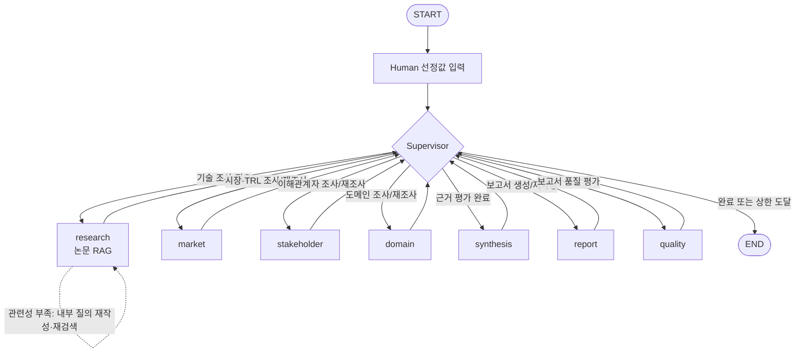

# KV cache 최적화 기술 평가 — Multi-Agent 설계 산출물 v6

> 목적: 기존 RAG 기반 기술 평가를 LangGraph Supervisor 패턴으로 확장한다.  
> 원칙: 특정 기술을 추천하거나 우열을 판정하지 않고, 동일한 기술이 기술 성숙도·시장성·이해관계자·도메인 관점에서 어떻게 다르게 평가되는지 근거 중심으로 제시한다.  
> 기준: `docs/AGENT_CONTRACT.md` v2.2.3, `docs/DEV_PLAN.md` v4, 실제 `state.py`·`graph.py`·`orchestration/supervisor.py` 구현.

| 항목 | 내용 |
|---|---|
| 캠퍼스 / 반 | 판교 / 8반 |
| 팀원 | 김명하, 김연주, 김효주, 안소유, 윤중우, 한석휘 |
| 대상 기술 | TurboQuant / InfiniGen |
| 선정 도메인 | 데이터센터·클라우드 LLM 서빙 |
| Agent 패턴 | Supervisor |
| 설계서 버전 | v6 — Supervisor, State 제어 계층, 품질 평가 및 재작업 루프 반영 |

---

## 0. 문제 정의

### 0-1. 분석 배경

LLM 추론에서 KV cache는 이미 처리한 토큰의 Key와 Value를 저장해 이후 토큰 생성에서 재사용한다. 중복 연산을 줄여 주지만, 요청의 문맥 길이와 동시 요청 수가 증가할수록 KV cache가 차지하는 메모리도 커진다. 데이터센터와 클라우드 서빙에서는 제한된 GPU HBM을 여러 요청이 나눠 사용하므로 KV cache 용량이 배치 크기, 동시 처리량, 응답 지연 및 GPU 시간당 비용에 직접 영향을 준다.

본 프로젝트는 이 문제에 대응하는 두 접근을 다음과 같이 구분한다.

| 진영 | 문제 해결 방향 | 대표적인 이점 | 대표적인 제약 |
|---|---|---|---|
| SW | KV cache 표현을 압축·양자화해 저장량과 처리 비용을 줄임 | 기존 GPU 환경에 소프트웨어 방식으로 적용 가능 | 압축에 따른 품질 변화와 변환 오버헤드 확인 필요 |
| HW | KV cache를 호스트 메모리 등 계층화된 메모리 공간으로 확장하고 필요한 항목을 전송 | GPU HBM보다 큰 저장 공간 활용 가능 | GPU와 호스트 사이 전송 지연 및 배포 복잡성 확인 필요 |

### 0-2. 선정 도메인과 핵심 질문

- 선정 도메인: **데이터센터·클라우드 LLM 서빙**
- 선정 이유: 두 기술 모두 장문맥·다중 요청 환경의 메모리 병목과 처리량 문제를 다루며, 비용·처리량·모델 품질·전송 오버헤드·배포 장벽이라는 공통 기준으로 평가할 수 있다.
- 핵심 질문: **데이터센터·클라우드 서빙에서 TurboQuant와 InfiniGen은 기술 성숙도, 시장성, 이해관계자, 도메인 적용 관점에 따라 각각 어떻게 다르게 평가되는가?**

---

## 1. 대상 기술

| 진영 | 기술 | 주요 문서 | 공개 시점 | RAG 문서 분량 |
|---|---|---|---|---:|
| SW | TurboQuant | *TurboQuant: Online Vector Quantization with Near-optimal Distortion Rate*, arXiv:2504.19874 | 2025 | 25쪽 |
| HW | InfiniGen | *InfiniGen: Efficient Generative Inference of Large Language Models with Dynamic KV Cache Management*, OSDI 2024 / arXiv:2406.19707 | 2024 | 18쪽 |
| | **합계** | | | **43쪽 / 제한 200쪽** |

### 1-1. 선정 사유

- **TurboQuant**는 KV cache 벡터를 온라인 양자화해 메모리 사용량과 어텐션 처리 비용을 줄이는 SW 접근이다. 재학습 또는 모델 구조 변경보다 도입 부담이 상대적으로 낮은 접근을 조사하기에 적합하다.
- **InfiniGen**은 KV cache를 호스트 메모리에 두고 필요한 항목을 예측·선별해 가져오는 동적 KV 관리 방식이다. 기존 서버의 GPU·CPU 메모리 계층을 활용하면서 전송량을 줄이는 접근을 조사하기에 적합하다.
- 두 기술은 모두 기존 서버 환경에서 동작할 수 있으므로 단순히 “새 하드웨어 유무”로 대비하지 않는다. 대신 **메모리 표현 축소와 선택적 오프로딩**, **품질 보존과 전송 비용**, **논문 성능과 실제 채택 근거**라는 차이를 비교한다.
- 이 비교의 목적은 사용 조건별 추천이 아니라, 서로 다른 평가 관점에서 각 기술이 받는 평가와 공개 근거의 한계를 드러내는 것이다.

### 1-2. 제외 후보

| 후보 | 제외 이유 |
|---|---|
| KIVI | 저비트 KV cache 양자화로 TurboQuant와 접근 축이 겹침 |
| MLA | 모델 구조 및 학습 단계 변경이 포함되어 사후 적용 기술과 비교 축이 달라짐 |
| ITME | 기술 공개 시점에 비해 시장·이해관계자 공개 자료가 제한될 가능성이 큼 |
| CXL-PIM | 별도 인프라와 장문맥 하드웨어 전제를 요구해 현재 선정 도메인의 구현 범위를 벗어남 |

---

## A. Agent Pattern 및 Agent 정의

### A-1. Supervisor 패턴 선정

Supervisor 패턴을 선택한 이유는 보고서 작성 전에 현재 State를 바탕으로 조사 완료 여부와 근거 충분성을 판단하고, 부족한 관점만 선택적으로 재실행해야 하기 때문이다.

| 설계 요구 | 반영 방식 |
|---|---|
| 동적 라우팅 | Supervisor가 현재 State를 읽고 매번 하나의 `next_node`를 결정 |
| 근거 충분성 확인 | `evaluate_sufficiency(state)`를 Supervisor의 판단 helper로 호출 |
| 선택적 재조사 | 부족한 관점을 담당하는 Agent만 다시 실행 |
| 결과 품질 개선 | 보고서 생성 후 Quality가 `pass`, `rewrite`, `research`를 권고 |
| 재현성 | 라우팅에는 LLM을 사용하지 않고 규칙과 동점 처리 순서를 고정 |
| 종료 보장 | 실행 실패, 근거 부족, 품질 재조사, 보고서 재작성 및 전체 step에 각각 상한 적용 |

Orchestrator-Workers는 계획을 동적으로 분할하고 여러 Worker를 병렬 생성하는 문제에 적합하다. 본 과제는 역할과 평가 관점이 이미 정해져 있고, 현재까지 확보된 근거에 따라 다음 담당을 선택하는 것이 핵심이므로 Supervisor가 더 적합하다.

### A-2. 구조 원칙

1. `START → select → supervisor`로 진입한다.
2. 모든 하위 Agent는 실행 후 반드시 Supervisor로 돌아온다.
3. 하위 Agent끼리 직접 연결하지 않는다.
4. `add_conditional_edges`는 Supervisor에만 둔다.
5. Supervisor는 한 번에 하나의 `next_node`만 선택한다.
6. 라우팅은 규칙 기반이며 같은 State에는 같은 선택을 반환한다.
7. `check`는 독립 노드가 아니라 Supervisor가 호출하는 충분성 판정 helper다.

### A-3. 구성 요소와 책임

| 구성 요소 | 책임 | 주요 입력 | 주요 출력 |
|---|---|---|---|
| `select` | 조가 선정한 기술과 도메인을 State에 설정 | `config` | `tech_sw`, `tech_hw`, `domain` |
| `supervisor` | 실행 결과 반영, 충분성 평가, 다음 노드 선택, 재시도·종료 관리 | 전체 State | `control`, 필요 시 `sufficiency` |
| `research` | 논문 RAG로 기술 원리·범위·수치·한계 추출 | 기술명, 논문 검색 결과 | `tech_summary`, `references`, `node_result` |
| `market` | TRL 및 시장 규모·채택·생태계 조사 | `tech_summary`, 웹 검색, 재조사 힌트 | `trl_result`, `market_result`, `references`, `node_result` |
| `stakeholder` | 경쟁 진영·도입자·개발자·투자 관점 조사 | `tech_summary`, 웹 검색, 재조사 힌트 | `stakeholder_result`, `references`, `node_result` |
| `domain` | 데이터센터·클라우드 서빙 적합성 평가 | 기술·도메인 정보, 웹 검색, 재조사 힌트 | `domain_result`, `references`, `node_result` |
| `synthesis` | 관점 간 일치·상충 및 한계 종합 | 기술·관점 결과, `sufficiency` | `synthesis`, `node_result` |
| `report` | 정해진 목차로 Markdown과 PDF 보고서 생성 | 전체 평가 결과, 재작성 feedback, 오류 | 보고서 경로·버전, `node_result` |
| `quality` | 보고서를 규칙과 LLM Judge로 평가하고 조치 권고 | 보고서·근거·버전 | `quality_result`, `node_result` |

### A-4. 공용 도구

| 도구 | 사용 Agent | 입력 | 출력 | 제한 및 검증 |
|---|---|---|---|---|
| 논문 RAG 검색 | `research` | 검색 질의, Top-k | 논문 청크, 페이지 메타데이터 | `arxiv:<id>#p<page>` 형식의 결정적 ID 사용 |
| 웹 검색 | `market`, `stakeholder`, `domain` | 질의, stance, 결과 수 | 검색 내용과 `Reference` | 실제 사용한 출처만 State에 반환 |
| LLM 구조화 출력 | 조사·종합·보고서 Agent | 근거가 포함된 프롬프트 | State 타입에 맞는 결과 | 입력 근거 밖 주장·수치 거부 |
| LLM Judge | `quality`만 사용 | 보고서 일부와 인용 Evidence | 4개 품질 항목 판정 | 네 항목을 한 번의 구조화 호출로 판정 |

---

## B. RAG 설계

### B-1. 기술 선정 방식

- 선택 방식: **Human 기반 선정**
- 확정 기술: TurboQuant / InfiniGen
- 사유: 제한 시간 안에 문서 분량, 논문 확보 가능성, 비교 축, 검색 평가셋을 사전에 검증하고 실행 재현성을 높이기 위해 기술 선정 자체는 Agent에게 맡기지 않았다.
- `select` 노드는 기술을 새로 추천하는 Agent가 아니라 이미 합의된 값을 State에 넣는 입력 노드다.

### B-2. RAG 적용 대상

- 적용 Agent: `research`
- 적용 문서: TurboQuant와 InfiniGen 논문 2편, 총 43쪽
- 적용 이유: 기술 원리, 실험 조건, 핵심 수치와 논문이 밝힌 한계는 원문 페이지에 근거해야 한다.
- 미적용 영역: 시장·이해관계자·도메인 정보는 논문 발표 이후의 채택과 반응이 핵심이므로 웹 검색을 사용한다.

| 단계 | 구현 | 설계 이유 |
|---|---|---|
| 로딩 | PyMuPDF 기반 페이지 로딩 | 원문 페이지를 Evidence와 Reference에 연결 |
| 청킹 | 800 token, overlap 100, 섹션 우선 분할 | 표·수식·실험 설명의 문맥 손실 완화 |
| 임베딩 | `BAAI/bge-m3` dense embedding | 한국어 질의와 영어 논문의 교차 언어 검색 |
| 저장 | FAISS 로컬 인덱스 및 fingerprint 캐시 | 반복 실행 시간 단축과 재현성 확보 |
| 검색 | Top-k 5, MMR fetch-k 10, λ=0.7 | 유사 청크 중복을 줄이고 근거 다양성 확보 |
| 메타데이터 | arXiv ID, 1-based page, section, source ID | 인용 페이지와 논문을 결정적으로 추적 |
| 검색 평가 | 한국어 질문 12개, Hit Rate@5와 MRR@5 | 검색 누락과 정답 순위 평가 |

Sparse·Hybrid 검색은 `bge-m3`가 지원할 수 있지만 이번 과제에서는 dense 검색으로 범위를 고정한다. 별도 인프라와 평가 조합을 늘리지 않고 측정된 검색 품질과 구현 재현성에 집중하기 위함이다.

### B-3. Embedding 모델

**선정 모델: `BAAI/bge-m3`**

| 선정 기준 | 판단 |
|---|---|
| 오픈소스 | MIT 라이선스로 로컬 실행 가능 |
| 다국어 | 한국어 질의와 영어 논문을 같은 임베딩 공간에서 검색 가능 |
| 긴 입력 | 논문 청크와 전문 용어가 포함된 질의 처리에 적합 |
| 비용 | 외부 임베딩 API 비용 없이 인덱스 생성 가능 |
| 확장성 | 이후 필요 시 같은 모델의 sparse 기능을 검토할 수 있음 |

검색 평가 결과는 다음과 같다.

| 구분 | Hit Rate@5 | MRR@5 |
|---|---:|---:|
| 전체 12문항 | 1.00 | 0.69 |
| TurboQuant 6문항 | 1.00 | 0.78 |
| InfiniGen 6문항 | 1.00 | 0.60 |

Hit Rate@5 1.00은 모든 질문에서 정답 페이지가 상위 5개 안에 포함됐음을 뜻한다. MRR@5 0.69는 정답 페이지가 대체로 상위 순위에서 검색됐음을 뜻한다. 기술별 MRR 차이는 질문과 근거 페이지의 분산 가능성을 보여 주는 관찰값이며, 별도 원인 실험 없이 확정 원인으로 해석하지 않는다.

### B-4. CorrectiveRAG 적용

`research` 내부에서 검색 결과의 관련성을 확인하고 부족하면 질의를 재작성한다.

```text
초기 질의 → 검색 → 관련성 판정
                     ├─ 충분 → 구조화 요약·검증
                     └─ 부족 → 질의 재작성 → 재검색 (최대 2회)
```

- 관련성 판정은 기술명 일치만이 아니라 원리·수치·한계를 직접 뒷받침하는지 확인한다.
- LLM이 만든 Evidence의 `source_id`가 검색된 청크에 없으면 거부한다.
- Evidence와 측정값의 숫자가 인용 페이지에 없으면 해당 주장 또는 결과를 거부한다.
- 정상 Evidence가 함께 있으면 검증 실패한 수치 Evidence만 제거한다.
- 한 기술만 확보하면 `E-1004`를 남기되 전체 실행은 `success`로 처리한다.
- 검색·API·PDF 오류는 `E-1001`~`E-1004` 계약에 따라 결과와 `node_result`에 반영한다.

---

## C. 평가 관점 및 기준

### C-1. 네 가지 평가 관점

| 관점 | 평가 대상 | 판정 기준 | 주요 정보원 | State |
|---|---|---|---|---|
| 기술 성숙도(TRL) | 논문, 코드, 프로토타입, 실제 환경 검증, 상용 채택 | 공개 근거로 확인 가능한 가장 높은 단계. 서로 다른 출처를 우선하고 공개 정보 기반 추정임을 명시 | 논문, GitHub, 기업·기관 발표 | `trl_result` |
| 시장성 | 관련 시장 성장, 해당 기술의 채택, 생태계 지원 | 시장 전체 성장과 개별 기술 채택을 분리해 서술. 실제 제품·통합·고객 근거 확인 | 시장 자료, 제품 발표, 산업 기사 | `market_result` |
| 이해관계자 | 경쟁 기술, 도입자·개발자, 투자·산업 관점 | 지지뿐 아니라 한계·도입 장벽·반론을 함께 검색. 공개 반응이 없으면 미확인으로 기록 | 공식 블로그, 기술 문서, 커뮤니티, IR·산업 자료 | `stakeholder_result` |
| 도메인 적용 | 비용, 처리량, 모델 품질, 전송 오버헤드, 배포 장벽 | 데이터센터·클라우드 서빙 환경에서 각 지표의 근거와 한계를 평가 | 논문 수치가 담긴 `tech_summary`, 웹 자료 | `domain_result` |

시장 규모가 성장한다는 사실을 특정 기술이 채택됐다는 근거로 사용하지 않는다. 이해관계자 반응이나 도입 사례가 공개되지 않았으면 추론으로 채우지 않고 “공개 근거 미확인”이라고 남긴다.

### C-2. TRL 판정 기준

| TRL | 평가 기준 | 공개 근거 예시 |
|---:|---|---|
| 1 | 기초 원리 관찰 | 이론·개념 제시 |
| 2 | 기술 개념 정립 | 적용 시나리오와 분석 |
| 3 | 개념 검증 | 논문 실험 결과 |
| 4 | 실험실 수준 구성요소 검증 | 공개 코드와 재현 실험 |
| 5 | 유사 환경 구성요소 검증 | 프로토타입과 벤치마크 |
| 6 | 실제 환경과 유사한 시스템 시연 | LLM 서빙 시스템 통합과 end-to-end 실험 |
| 7 | 실제 운용 환경 시제품 시연 | pilot·preview·beta 적용 |
| 8 | 시스템 완성 및 운영 검증 | 정식 출시와 고객·운영 적용 검증 |
| 9 | 실제 운용·상용 확산 | 제품 탑재, 반복 운영, 상용 납품 |

- 해당 단계의 근거가 서로 다른 출처에서 확인되는지를 함께 본다.
- 통합 PR이나 출시 발표만으로 실제 운영 검증 단계를 단정하지 않는다.
- 보고서에는 “본 TRL은 공개 정보 기반 추정이며 실제 적용 수준과 다를 수 있음”을 명시한다.

### C-3. 충분성 및 편향 통제 기준

충분성은 관점별·기술별로 평가한다.

| 항목 | 기준 |
|---|---|
| TRL Evidence | 기술별 2건 이상 |
| 나머지 관점 Evidence | 관점별·기술별 4건 이상 |
| stance | positive 1건 이상, negative 1건 이상 |
| 출처 편중 | 하나의 `source_id`가 관점 근거의 50%를 초과하지 않음 |
| 부족 처리 | 해당 관점 노드만 재조사하고, 끝까지 없으면 근거를 생성하지 않고 `E-1005`와 한계로 기록 |

여기서 negative는 기술이 열등하다는 판정이 아니라 제한 조건, 반론, 배포 장벽을 보여 주는 근거를 뜻한다. 개수를 맞추기 위해 stance를 바꾸거나 근거를 생성하지 않는다.

---

## D. State 및 Graph 설계

### D-1. State Schema

State는 입력, Agent payload, 실행 결과, 품질 평가, 제어 메타데이터의 다섯 영역으로 나눈다. 하위 Agent는 자기 payload와 `node_result`만 반환하며 `control`은 Supervisor만 수정한다.

#### 최상위 State

| 영역 | 키 | 타입 | 생산자 | 주요 소비자 | 설명 |
|---|---|---|---|---|---|
| 입력 | `tech_sw` | `TechName` | `select` | `research` | TurboQuant |
| 입력 | `tech_hw` | `TechName` | `select` | `research` | InfiniGen |
| 입력 | `domain` | `str` | `select` | `domain`, `report` | 데이터센터·클라우드 서빙 |
| payload | `tech_summary` | `dict[TechName, TechSummary]` | `research` | 평가·종합·보고서 | 기술 원리·범위·수치·한계 |
| payload | `trl_result` | `dict[TechName, TRLEstimate]` | `market` | 충분성·종합·보고서 | TRL 추정 |
| payload | `market_result` | `dict[TechName, MarketResult]` | `market` | 충분성·종합·보고서 | 성장·채택·생태계 |
| payload | `stakeholder_result` | `dict[TechName, StakeholderResult]` | `stakeholder` | 충분성·종합·보고서 | 집단별 근거 |
| payload | `domain_result` | `dict[TechName, DomainResult]` | `domain` | 충분성·종합·보고서 | 도메인 5개 지표 |
| payload | `sufficiency` | `SufficiencyCheck` | `supervisor` | 재조사 Agent·`synthesis` | 관점별 충분 여부와 사유 |
| payload | `synthesis` | `Synthesis` | `synthesis` | `report` | 일치·상충·중립성·한계 |
| payload | `references` | `Annotated[list[Reference], operator.add]` | 조사 Agent | `report`, `quality` | 이번 실행에서 실제 사용한 출처 누적 |
| 보고서 | `report_path` | `str` | `report` | `quality`, 사용자 | PDF 경로 |
| 보고서 | `report_md_path` | `str` | `report` | `quality` | 품질 평가용 Markdown 원문 경로 |
| 보고서 | `report_version` | `int` | `report` | `supervisor`, `quality` | 생성 시마다 1 증가, 초기값 0 |
| 실행 | `node_result` | `NodeResult` | 모든 하위 Agent | `supervisor` | 직전 실행 성공·실패와 dispatch ID |
| 품질 | `quality_result` | `QualityResult` | `quality` | `supervisor`, `report` | 네 품질 항목과 다음 조치 권고 |
| 제어 | `control` | `ControlState` | `supervisor` | Supervisor·하위 Agent 일부 | 라우팅·재시도·오류·추적·종료 상태 |

#### 공통 근거 구조

| 구조 | 핵심 필드 | 용도 |
|---|---|---|
| `Reference` | `source_id`, kind, author, date, title, venue, url, `used_by`, stance | 실제 사용한 출처의 서지정보 |
| `Evidence` | claim, `source_id`, stance | 주장과 출처를 결정적으로 연결 |
| `TechSummary` | name, camp, approach, scope, key_metrics, limitations, evidence | 논문 기반 기술 요약 |
| `SufficiencyCheck` | trl, market, stakeholder, domain, reasons | 부족 관점과 재조사 힌트 |
| `Synthesis` | agreements, conflicts, neutrality_note, limitations | 관점 간 합의·충돌과 한계 |

#### 실행·품질·제어 구조

```python
class NodeResult(TypedDict):
    node: NodeName
    dispatch_id: int
    status: Literal["success", "failed"]
    error: str


class MetricResult(TypedDict):
    rule_passed: bool
    judge_passed: bool | None
    passed: bool
    reasons: list[str]


class QualityResult(TypedDict):
    groundedness: MetricResult
    neutrality: MetricResult
    bias_control: MetricResult
    perspective_coverage: MetricResult
    page_count: int
    page_limit_passed: bool
    required_sections_passed: bool
    passed: bool
    feedback: list[str]
    evaluated_report_version: int
    action: Literal["pass", "rewrite", "research"]
    target_node: str


class ControlState(TypedDict):
    next_node: str
    route_reason: str
    dispatch_id: int
    step_count: int
    exec_retry_counts: dict[str, int]
    evidence_retry_counts: dict[str, int]
    report_retry_count: int
    node_status: dict[str, str]
    node_errors: dict[str, str]
    last_error: str
    finalize_tried: list[str]
    quality_research_count: int
    stale: list[str]
    trace_id: str
    run_status: Literal["running", "completed", "exhausted"]
```

#### State Schema 설계 판단

| 평가 항목 | 설계 반영 | 이유 |
|---|---|---|
| 제어와 payload 분리 | 모든 라우팅 메타데이터를 `control`에 두고 결과 필드는 최상위 payload로 유지 | 하위 Agent가 경로를 변경하지 못하게 하고 업무 결과와 실행 제어를 구분 |
| 관측성 위치 | State에는 현재 `route_reason`만 유지하고 전체 결정 이력은 LangSmith trace에 기록 | 체크포인트마다 결정 이력이 누적돼 State가 커지는 것을 방지 |
| 지속성 비용 | 보고서 전문 대신 파일 경로와 버전만 State에 저장 | Markdown·PDF 본문이 매 단계 복제되는 것을 방지 |
| 상관관계 | `control.trace_id`와 LangSmith metadata의 `trace_id`를 동일하게 전달 | State와 외부 실행 기록을 검색·대조 가능 |
| 재개·복구 | `node_status`, `node_errors`, 재시도 카운터, `dispatch_id`, `run_status` 유지 | 실행 중 실패 지점과 남은 재시도 기회를 판단 가능 |
| 동시 처리 | 이번 Supervisor는 순차 실행하며 동적 fan-out을 사용하지 않음. `references` reducer는 여러 조사 노드의 출처 누적을 위해 유지 | 병렬 쓰기 충돌을 피하면서 기존 출처 누적 계약 보존 |
| 종료 보장 | 노드별 재시도, 품질 재작업, 전체 step과 LangGraph recursion에 상한 적용 | 무한 순환을 막고 실패 시에도 가능한 범위에서 보고서 생성 |

`dispatch_id`는 Supervisor가 하위 노드를 선택할 때 현재 `step_count`로 갱신한다. 하위 노드는 이 값을 그대로 `node_result`에 돌려준다. Supervisor는 노드 이름과 `dispatch_id`가 일치할 때만 직전 결과로 인정하므로 과거 실행 결과가 현재 실행을 덮어쓰는 것을 막는다.

### D-2. Graph 흐름



Mermaid의 라벨은 가능한 경로를 설명한다. 실제 다음 노드는 고정 순서가 아니라 Supervisor의 `add_conditional_edges`가 현재 State를 평가해 하나만 고른다.

### D-3. Supervisor 라우팅 규칙

일반 모드에서는 다음 우선순위를 적용한다.

| 순위 | 조건 | 선택 |
|---:|---|---|
| 1 | 직전 노드 실행 실패, 실행 재시도 여유 있음 | 같은 노드 재실행 |
| 2 | 실행 재시도 상한 도달 | 해당 노드를 `skipped` 처리하고 가능한 다음 단계 진행 또는 종료 |
| 3 | `tech_summary` 없음 | `research` |
| 4 | 아직 실행하지 않은 관점 Agent 존재 | 근거가 가장 적은 Agent |
| 5 | 충분성 미달 관점과 재조사 여유 존재 | 해당 관점 Agent 재조사 |
| 6 | `synthesis` 없음 또는 stale | `synthesis` |
| 7 | 보고서 없음 또는 stale | `report` |
| 8 | 현재 보고서 버전의 품질 평가 없음 | `quality` |
| 9 | 품질 미달이며 근거 보강 필요 | Quality가 지정한 관점 Agent |
| 10 | 품질 미달이며 보고서 수정 필요 | `report` 재작성 |
| 11 | 통과 또는 재작업 상한 도달 | `END` |

관점 후보가 여러 개면 두 기술의 Evidence 합계가 가장 적은 관점을 우선한다. 근거 수가 같으면 `market → stakeholder → domain` 순서를 동점 처리에만 사용한다. 이 순서는 고정 workflow가 아니라 같은 State에서 같은 결과를 만들기 위한 결정 규칙이다.

### D-4. Loop와 종료 조건

| 반복 유형 | 카운터·상한 | 종료 또는 다음 단계 |
|---|---|---|
| 실행 실패 재시도 | `MAX_EXEC_RETRY = 1` | 재실패 시 `skipped`; 가능한 산출물로 진행하거나 종료 |
| 근거 부족 재조사 | Agent별 `MAX_AGENT_RETRY = 2` | 충분하면 종합, 부족하면 `E-1005`와 한계 기록 후 진행 |
| 품질 기반 추가 조사 | 전체 `MAX_QUALITY_RESEARCH = 1` | 재조사 후 synthesis·report를 stale로 표시해 다시 생성 |
| 보고서 재작성 | `MAX_REPORT_RETRY = 1` | 새 `report_version`을 quality가 다시 평가 |
| 전체 안전장치 | `MAX_TOTAL_STEPS = 24` | 마무리 모드에서 synthesis·report·quality를 각각 최대 1회 시도 후 종료 |
| LangGraph recursion | `RECURSION_LIMIT = 64` | 그래프 수준 무한 순환 방지 |

전체 step 상한은 근거가 부족해도 보고서 단계로 강제 진입시키는 조건이 아니다. 정상 흐름의 보고서 진입 조건은 충분성 평가 결과이며, 전체 상한은 반복 실패로 종료하지 못하는 경우의 안전장치다. 상한에 도달하면 `run_status="exhausted"`로 남겨 정상 완료와 구분한다.

### D-5. Hybrid 보고서 품질 평가

보고서 생성 후 반드시 Quality Agent를 실행한다. 각 항목은 결정적인 규칙 검사와 의미를 판단하는 LLM Judge를 결합한다.

| 품질 항목 | 규칙 검사 | LLM Judge | 목적 |
|---|---|---|---|
| Groundedness | 대상 절의 인용이 REFERENCE와 연결되고 근거 칸에 인용이 있는지 | 인용 문장이 해당 Evidence claim과 의미상 일치하는지 | 출처 추적과 환각 통제 |
| Neutrality | 추천·우열 표현 금지어 검사 | 문맥에 암묵적 추천이나 우열 판단이 있는지 | 기술 평가 목적 유지 |
| Bias control | negative 근거 반영 및 복수 출처 확보 시 단일 출처 편중 검사 | 서술이 한쪽 근거에 치우쳤는지 | 확증편향 완화 |
| Perspective coverage | 4관점×2기술 서술 또는 “공개 근거 미확인” 표시 확인 | 형식적 언급이 아닌 실질 평가인지 | 다관점 평가 완결성 |

추가 형식 검사는 PDF 10쪽 이내 여부와 SUMMARY·REFERENCE 절 존재 여부를 확인한다. 최종 `passed`는 네 품질 항목, 페이지 제한, 필수 목차를 모두 통과해야 True다.

| Quality 권고 | 발생 조건 | Supervisor 처리 |
|---|---|---|
| `pass` | 모든 평가 통과 | `END`, `run_status="completed"` |
| `rewrite` | State 근거는 있으나 보고서 표현·인용·목차·분량에 문제 | feedback을 반영해 `report` 최대 1회 재작성 후 재평가 |
| `research` | State 자체의 관점 근거가 부족하거나 stance·출처가 편중 | 지정 관점 Agent 최대 1회 추가 조사 → synthesis → report → quality 재실행 |

Quality는 다음 노드를 직접 선택하지 않고 `action`과 `target_node`만 권고한다. 최종 분기는 항상 Supervisor가 상한, skipped 상태와 현재 State를 확인한 뒤 결정한다.

### D-6. 실패 처리와 관측성

- 모든 하위 Agent는 성공과 실패 모두 `node_result`를 반환하고 예외를 그래프 밖으로 던지지 않는다.
- `E-1002`, `E-1003`처럼 실행 자체가 불가능한 경우는 `failed`다.
- `E-1001`, `E-1004`처럼 실행은 됐지만 결과가 적은 경우는 `success`이며 충분성 평가에서 다룬다.
- 외부 예외 원문과 API 키는 `node_result.error`, 로그, 보고서에 넣지 않는다.
- Supervisor는 마지막 실패를 `control.node_errors`에 보존하고 보고서는 이를 수집 오류 절에 반영한다.
- LangSmith metadata와 State에 동일한 `trace_id`를 전달한다.
- `route_reason`은 한국어 한 줄로 현재 판단만 저장하며, 전체 판단 과정은 LangSmith trace에서 확인한다.
- 웹 검색과 LLM 결과는 실행 시점에 따라 달라질 수 있으나 규칙 기반 라우팅과 종료 조건은 결정적으로 유지한다.
- 프로세스 종료 후의 영속 재개(SQLite checkpointer 등)는 이번 범위에서 제외한다.

---

## E. 평가 보고서 목차

보고서 전체는 **최대 10쪽**으로 제한한다.

| 순서 | 장 | 권장 분량 | 주요 State | 내용 |
|---:|---|---:|---|---|
| 0 | SUMMARY | 0.5쪽 이내 | 전체 결과 | 핵심 관찰과 공개 근거의 한계 요약 |
| 1 | 분석 배경 | 0.5쪽 | 입력·도메인 | KV cache 문제와 분석 목적 |
| 2 | 기술 선정 | 0.5쪽 | 기술 입력 | 두 기술과 비교 축 선정 이유 |
| 3 | 기술 개요 | 2쪽 | `tech_summary` | 원리, 적용 범위, 핵심 수치, 한계 |
| 4 | 관점별 평가 | 4쪽 | 4개 관점 결과 | 4-1 TRL, 4-2 시장성, 4-3 이해관계자, 4-4 도메인 적용 |
| 5 | 시사점 | 1쪽 | `synthesis` | 관점별 일치·충돌 지점 |
| 6 | 한계점·수집 오류 | 0.5쪽 | `synthesis.limitations`, `control.node_errors` | 근거 미확인, 재조사 상한, 공개 정보 한계 |
| 7 | REFERENCE | 잔여 분량 | `references` | 본문에서 실제 사용한 출처만 정리 |

### E-1. 인용과 REFERENCE

- 본문 주장은 `source_id`를 통해 Evidence와 Reference에 연결한다.
- 논문 Evidence는 페이지 단위 ID를 유지해 본문에서 페이지를 추적할 수 있게 한다.
- REFERENCE 절에서는 같은 논문의 여러 페이지를 문서 단위로 합치되 본문 페이지 정보는 유지한다.
- `used_by`가 있는 실제 사용 출처만 기재한다.
- 보고서의 특정 기술 추천·우열 판정 표현을 금지한다.

---

## F. 역할 분담

| # | 담당 | 역할 | 주요 파일·산출물 |
|---:|---|---|---|
| 1 | 한석휘 | 테스트·검증, RAG 파이프라인 유지 | `tests/fixtures.py`, `tests/test_supervisor.py`, `rag/` |
| 2 | 김명하 | 기술 조사, 검색 평가, 설계 문서 | `agents/research.py`, `tests/test_research*.py`, `eval/`, `docs/RAG-Design_v6.md` |
| 3 | 안소유 | 시장·TRL 평가와 웹 검색 | `agents/market.py`, `tools/web_search.py` |
| 4 | 김연주 | 이해관계자·도메인 평가와 충분성 helper | `agents/stakeholder.py`, `agents/domain.py`, `agents/check.py` |
| 5 | 윤중우 | Supervisor·State·Graph·종합 | `orchestration/supervisor.py`, `state.py`, `config.py`, `graph.py`, `app.py`, `agents/synthesis.py` |
| 6 | 김효주 | Hybrid 품질 평가, 보고서, README, 제출물 | `agents/quality.py`, `agents/report.py`, `README.md` |

PM·PL 명칭은 사용하지 않고 실제 수행 역할로 표기한다.

---

## G. 구현 검증 및 제출 체크리스트

### G-1. 현재 검증 결과

- [x] Supervisor hub-and-spoke Graph 구현
- [x] 모든 하위 노드의 `node_result` 반환 계약 적용
- [x] 충분성 부족 관점 선택 재조사 구현
- [x] Hybrid Quality와 `pass`·`rewrite`·`research` 권고 구현
- [x] 보고서 버전 기반 재평가 구현
- [x] 실행·재조사·재작성·전체 step 상한 구현
- [x] 검색 평가: Hit Rate@5 1.00, MRR@5 0.69
- [x] 전체 테스트: 263 passed
- [x] `python app.py --dummy`: `run_status=completed`, 품질 통과
- [x] 폐기 State `retry_count`와 `config.MAX_RETRY` 제거

### G-2. 제출 전 확인

- [ ] 실제 API·논문·웹 검색을 사용한 전체 실행 완료
- [ ] LangSmith에서 재작업이 1회 이상 포함된 실제 실행 trace 캡처
- [ ] 긴 trace는 `tracing-1.png`, `tracing-2.png`처럼 순서가 드러나는 파일명 사용
- [ ] 최종 PDF 10쪽 이내 및 SUMMARY·REFERENCE 존재 확인
- [ ] GitHub 결과물을 기존 RAG 작업과 별도 브랜치로 구분
- [ ] README Contributors에 개인별 실제 역할을 기재하고 PM·PL 표기 제외
- [ ] 제출 ZIP에 GitHub 링크, trace 이미지, 최종 PDF 포함 여부 확인
- [ ] API 키, `.env`, 캐시, 로컬 인덱스, 논문 PDF가 공개 저장소에 포함되지 않았는지 확인

---

## H. 설계 결정 요약

1. 기술 선정은 Human이 수행하고 Agent는 선택된 기술의 근거 조사와 평가에 집중한다.
2. 논문 원문이 필요한 기술 조사는 RAG, 시점 변화가 큰 시장·채택·이해관계자·도메인은 웹 검색을 사용한다.
3. Supervisor는 규칙 기반으로 하나의 하위 Agent만 선택하며 모든 Agent는 Supervisor로 복귀한다.
4. 근거 충분성은 Supervisor가 helper로 판정하고 독립 `check` 노드는 두지 않는다.
5. State는 payload와 `control`을 분리하고 `dispatch_id`로 직전 실행 결과를 검증한다.
6. 품질 평가는 규칙과 LLM Judge를 결합하며, 문제 원인에 따라 보고서 재작성 또는 관점 재조사를 권고한다.
7. 모든 반복 경로에 상한을 두고 정상 완료와 상한 종료를 `run_status`로 구분한다.
8. 최종 산출물은 우열·추천이 아니라 관점별 평가 차이, 공개 근거, 불확실성과 한계를 전달한다.
